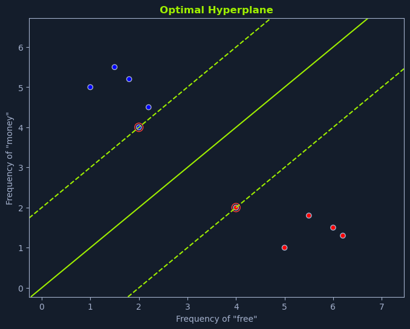
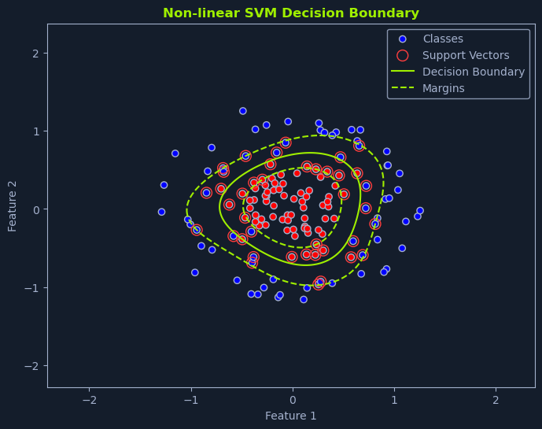

# Support Vector Machines (SVMs)

## Overview


*Scatter plot showing SVM decision boundary with classes, support vectors, and margins*

**Support Vector Machines (SVMs)** are powerful supervised learning algorithms for classification and regression tasks. They are particularly effective in handling high-dimensional data and complex non-linear relationships between features and the target variable.

SVMs aim to find the **optimal hyperplane** that maximally separates different classes or fits the data for regression.

---

## Maximizing the Margin

An SVM aims to find the hyperplane that **maximizes the margin**. The margin is the distance between the hyperplane and the nearest data points of each class.

### Support Vectors

These nearest data points are called **support vectors** and are crucial in defining:
- The hyperplane
- The margin

### Why Maximize the Margin?

By maximizing the margin, SVMs aim to find a robust decision boundary that generalizes well to new, unseen data. A larger margin provides:
- More separation between the classes
- Reduced risk of misclassification
- Better generalization to unseen data

---

## Linear SVM

A **linear SVM** is used when the data is linearly separable, meaning a straight line or hyperplane can perfectly separate the classes. The goal is to find the optimal hyperplane that maximizes the margin while correctly classifying all the training data points.

---

## Finding the Optimal Hyperplane

Imagine you're tasked with classifying emails as spam or not spam based on the frequency of the words "free" and "money." If we plot each email on a graph:
- **x-axis**: Frequency of "free"
- **y-axis**: Frequency of "money"

We can visualize how SVMs work.


*Scatter plot showing optimal hyperplane separating data points with margins*

### Key Concepts

**The Optimal Hyperplane** is the one that maximizes the margin between the closest data points of different classes.

**The Margin** (also called the separating hyperplane) is the distance between the hyperplane and the support vectors.

**Support Vectors** are the data points closest to the hyperplane, as they "support" or define the hyperplane and the margin.

### Benefits of Maximizing the Margin

Maximizing the margin creates a robust classifier:

1. **Tolerance to Noise**: A larger margin allows the SVM to tolerate some noise or variability in the data without misclassifying points

2. **Better Generalization**: It improves the model's generalization ability, making it more likely to perform well on unseen data

### Spam Classification Example

In the spam classification scenario depicted in the graph:
1. The linear SVM identifies the line that maximizes the distance between the nearest spam and non-spam emails
2. This line serves as the decision boundary for classifying new emails
3. Emails falling on one side of the line are classified as spam
4. Emails on the other side are classified as not spam

---

## The Hyperplane Equation

The hyperplane is defined by an equation of the form:

```python
w * x + b = 0
```

### Components

**Where:**
- **w**: The weight vector, perpendicular to the hyperplane
- **x**: The input feature vector
- **b**: The bias term, which shifts the hyperplane relative to the origin

The SVM algorithm learns the optimal values for **w** and **b** during the training process.

---

## Non-Linear SVM


*Scatter plot with non-linear SVM decision boundary, showing classes, support vectors, and margins*

In many real-world scenarios, data is **not linearly separable**. This means we cannot draw a straight line or hyperplane to perfectly separate the different classes. In these cases, **non-linear SVMs** come to the rescue.

---

## Kernel Trick

Non-linear SVMs utilize a technique called the **kernel trick**. This involves using a kernel function to map the original data points into a higher-dimensional space where they become linearly separable.

### Visualization Example

Imagine separating a mixture of red and blue marbles on a table:
- If the marbles are mixed in a complex pattern, you might be unable to draw a straight line to separate them
- However, if you could lift some marbles off the table (into a higher dimension), you might be able to find a plane that separates them

This is essentially what a kernel function does:
1. It transforms the data into a higher-dimensional space
2. A linear hyperplane can be found in this new space
3. This hyperplane corresponds to a non-linear decision boundary when mapped back to the original space

---

## Kernel Functions

Several kernel functions are commonly used in non-linear SVMs:

### 1. Polynomial Kernel

**Purpose**: Introduces polynomial terms (like x², x³, etc.) to capture non-linear relationships between features.

**Analogy**: It's like adding curves to the decision boundary.

**Use Case**: When relationships between features follow polynomial patterns.

---

### 2. Radial Basis Function (RBF) Kernel

**Purpose**: Uses a Gaussian function to map data points to a higher-dimensional space.

**Popularity**: One of the most popular and versatile kernel functions.

**Capability**: Capable of capturing complex non-linear patterns.

**Use Case**: Default choice for many applications due to its flexibility.

---

### 3. Sigmoid Kernel

**Purpose**: Similar to the sigmoid function used in logistic regression.

**Functionality**: Introduces non-linearity by mapping data points to a space with a sigmoid-shaped decision boundary.

**Use Case**: When decision boundaries have sigmoid-like characteristics.

---

### Choosing a Kernel

The kernel function choice depends on:
- The nature of the data
- The desired complexity of the model
- The computational resources available
- Prior knowledge about the problem domain

---

## Image Classification Example

Non-linear SVMs are particularly useful in applications like **image classification**. Images often have complex patterns that linear boundaries cannot separate.

### Cat vs. Dog Classification

Imagine classifying images of cats and dogs:

**Features might include:**
- Fur texture
- Ear shape
- Facial features

**Challenge**: These features often have non-linear relationships

**Solution**: A non-linear SVM with an appropriate kernel function can:
1. Capture these complex relationships
2. Effectively separate cat images from dog images

---

## The SVM Optimization Problem

Finding the optimal hyperplane involves solving an **optimization problem**. The problem can be formulated as:

```python
Minimize: 1/2 ||w||²

Subject to: yi(w * xi + b) >= 1 for all i
```

### Components

**Where:**
- **w**: The weight vector that defines the hyperplane
- **xi**: The feature vector for data point i
- **yi**: The class label for data point i (-1 or 1)
- **b**: The bias term

### Objective

This formulation aims to:
1. **Minimize** the magnitude of the weight vector (which maximizes the margin)
2. **Ensure** that all data points are correctly classified with a margin of at least 1

---

## Data Assumptions

SVMs have few assumptions about the data, making them versatile:

### 1. No Distributional Assumptions
SVMs do not make strong assumptions about the underlying distribution of the data.

**Advantage**: Can work with various data distributions without requiring normalization or transformation.

---

### 2. Handles High Dimensionality
They are effective in high-dimensional spaces, where the number of features is larger than the number of data points.

**Advantage**: Particularly useful for text classification, genomics, and other high-dimensional applications.

---

### 3. Robust to Outliers
SVMs are relatively robust to outliers, focusing on maximizing the margin rather than fitting all data points perfectly.

**Advantage**: Less sensitive to noise and anomalous data points compared to some other algorithms.

---

## Advantages and Limitations

### ✅ Advantages

- **Effective in high-dimensional spaces** - Works well even when features outnumber samples
- **Memory efficient** - Uses only support vectors for prediction
- **Versatile** - Different kernel functions enable various decision boundaries
- **Robust to outliers** - Focuses on margin maximization, not fitting every point
- **Strong theoretical foundation** - Based on solid mathematical principles
- **Works well with clear margin of separation** - Excellent for well-separated classes

### ⚠️ Limitations

- **Computationally expensive** - Training time increases with dataset size
- **Sensitive to kernel choice** - Wrong kernel can lead to poor performance
- **Doesn't provide probability estimates** - Unlike some classifiers (can be added with extra computation)
- **Difficult to interpret** - Less intuitive than decision trees
- **Requires feature scaling** - Performance depends on proper normalization
- **Struggles with overlapping classes** - Less effective when classes heavily overlap

---

## Summary

Support Vector Machines are powerful and versatile algorithms that have proven effective in various machine-learning tasks:

**Key Strengths:**
- Handle high-dimensional data effectively
- Capture complex non-linear relationships through kernel functions
- Maximize margin for robust classification
- Relatively few assumptions about data

**Core Concepts:**
- **Margin**: Distance between hyperplane and nearest points
- **Support Vectors**: Points that define the margin
- **Hyperplane**: Decision boundary that separates classes
- **Kernel Trick**: Maps data to higher dimensions for linear separability

**Types:**
- **Linear SVM**: For linearly separable data
- **Non-Linear SVM**: Uses kernel functions for complex patterns

Their ability to handle high-dimensional data and complex non-linear relationships makes them a valuable tool for solving challenging classification and regression problems, particularly in text classification, image recognition, and bioinformatics.
