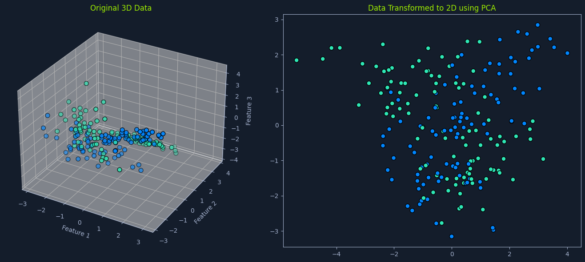
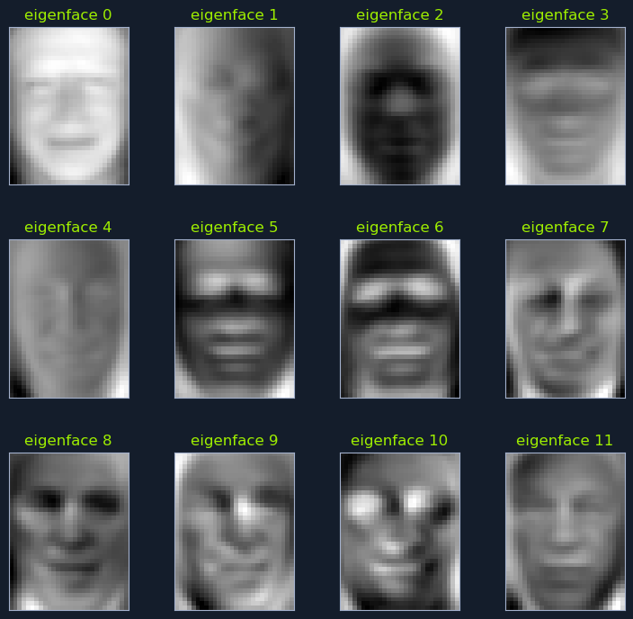
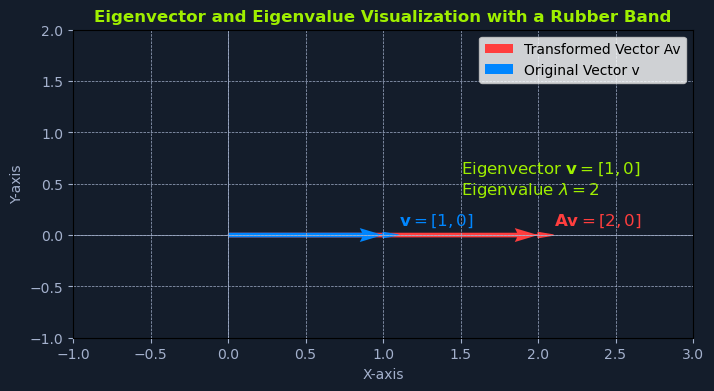

# Principal Component Analysis (PCA)

## Overview


*Side-by-side plots: Original 3D data and its 2D transformation using PCA*

**Principal Component Analysis (PCA)** is a dimensionality reduction technique that transforms high-dimensional data into a lower-dimensional representation while preserving as much original information as possible.

### How It Works

It achieves this by identifying the **principal components**—new variables that are:
- Linear combinations of the original features
- Capturing the maximum variance in the data

### Applications

PCA is widely used for:
- **Feature extraction**: Identifying the most important features
- **Data visualization**: Reducing data to 2D or 3D for plotting
- **Noise reduction**: Removing less important variations

---

## Real-World Example: Image Processing

In image processing, PCA can reduce the dimensionality of image data by identifying the principal components that capture the most important features of the images:
- Edges
- Textures
- Shapes

### Intuition

Think of it as finding the most important **"directions"** in the data. Imagine a scatter plot of data points. PCA finds the lines that best capture the spread of the data. These lines represent the principal components.

---

## Facial Recognition Example


*Grid of 12 eigenfaces labeled from 0 to 11, showing abstract facial patterns used in facial recognition*

Consider a database of facial images. PCA can be used to:

1. **Identify principal components** that capture the most significant variations in facial features:
   - Eye shape
   - Nose size
   - Mouth width

2. **Project facial images** onto a lower-dimensional space defined by these principal components

3. **Efficiently search** for similar faces in this reduced space

These principal components in facial recognition are often called **"eigenfaces"**—they represent the fundamental patterns that distinguish different faces.

---

## Key Concepts in PCA

### 1. Variance

**Definition:** Variance measures the spread or dispersion of data points around the mean.

**Role in PCA:** PCA aims to find principal components that **maximize variance**, capturing the most significant information in the data.

**Intuition:** Directions with high variance contain more information about the data's structure.

---

### 2. Covariance

**Definition:** Covariance measures the relationship between two variables.

**Role in PCA:** PCA considers the covariance between different features to identify the directions of maximum variance.

**Formula:**
```python
Cov(X, Y) = Σ[(xi - μx)(yi - μy)] / (n - 1)
```

**Interpretation:**
- **Positive covariance**: Variables tend to increase together
- **Negative covariance**: When one increases, the other decreases
- **Zero covariance**: No linear relationship

---

### 3. Eigenvectors and Eigenvalues

**Eigenvectors:** Represent the **directions** of the principal components.

**Eigenvalues:** Represent the **amount of variance** explained by each principal component.

**Relationship:** Larger eigenvalues indicate principal components that capture more variance in the data.

---

## The PCA Algorithm

The PCA algorithm follows these steps:

### Step 1: Standardize the Data

**Purpose:** Ensure that all features have the same scale.

**Process:**
- Subtract the mean from each feature
- Divide by the standard deviation for each feature

**Formula:**
```python
z = (x - μ) / σ
```

**Why It Matters:** Features with larger scales would otherwise dominate the principal components.

---

### Step 2: Calculate the Covariance Matrix

**Purpose:** Compute the covariance matrix of the standardized data.

**Result:** This matrix represents the relationships between different features.

**Formula:**
```python
C = (1/n) * X^T * X
```

Where:
- **C**: Covariance matrix
- **X**: Centered data matrix
- **n**: Number of samples

---

### Step 3: Compute Eigenvectors and Eigenvalues

**Purpose:** Determine the eigenvectors and eigenvalues of the covariance matrix.

**Result:**
- **Eigenvectors**: Directions of the principal components
- **Eigenvalues**: Amount of variance explained by each principal component

**Methods:**
- Eigenvalue decomposition
- Singular Value Decomposition (SVD) - more numerically stable

---

### Step 4: Sort the Eigenvectors

**Purpose:** Order eigenvectors by their importance.

**Process:** Sort the eigenvectors in **descending order** of their corresponding eigenvalues.

**Reason:** The eigenvectors with the highest eigenvalues capture the most variance in the data.

---

### Step 5: Select the Principal Components

**Purpose:** Choose the number of dimensions for the reduced representation.

**Process:** Choose the **top k eigenvectors**, where k is the desired number of dimensions.

**Trade-off:** Balance between dimensionality reduction and information preservation.

---

### Step 6: Transform the Data

**Purpose:** Project the original data onto the selected principal components.

**Process:** Multiply the original data by the matrix of selected eigenvectors.

**Formula:**
```python
Y = X * V
```

Where:
- **Y**: Transformed data in lower-dimensional space
- **X**: Original data matrix
- **V**: Matrix of selected eigenvectors

**Result:** Obtain the lower-dimensional representation that preserves maximum variance.

---

## Eigenvalues and Eigenvectors

Before diving into the eigenvalue equation, it's important to understand what eigenvectors and eigenvalues are and their significance in linear algebra and machine learning.

### Definition

An **eigenvector** is a special vector that remains in the same direction when a linear transformation (such as multiplication by a matrix) is applied to it.

### Mathematical Representation

Mathematically, if **A** is a square matrix and **v** is a non-zero vector, then **v** is an eigenvector of **A** if:

```python
A * v = λ * v
```

**Where:**
- **A**: Square matrix (transformation)
- **v**: Eigenvector
- **λ** (lambda): Eigenvalue

### Interpretation

The eigenvalue **λ** represents the **scalar factor** by which the eigenvector **v** is scaled during the linear transformation.

In other words:
- When you multiply the matrix A by its eigenvector v
- The result is a vector that points in the same direction as v
- But stretches or shrinks by a factor of λ

---

## Rubber Band Analogy


*Graph showing eigenvector [1, 0] and transformed vector [2, 0] with eigenvalue 2*

Consider a rubber band stretched along a coordinate system. A vector can represent the rubber band, and we can transform it using a matrix.

### Example

**Initial state:**
- Rubber band aligned with the x-axis
- Length of 1 unit
- Represented by vector: `v = [1, 0]`

**Transformation:**
Apply a linear transformation (stretching) represented by the matrix:

```python
A = [[2, 0],
     [0, 1]]
```

**Result:**
When we multiply the matrix A by the vector v:

```python
A * v = [[2, 0],      [1]   [2]
         [0, 1]]  *   [0] = [0]
```

**Interpretation:**
- The resulting vector is `[2, 0]`
- Points in the **same direction** as the original vector v
- Has been **stretched by a factor of 2**
- **Eigenvector**: `v = [1, 0]`
- **Eigenvalue**: `λ = 2`

---

## The Eigenvalue Equation in PCA

In Principal Component Analysis (PCA), the eigenvalue equation helps identify the principal components of the data.

### The Equation

The principal components are obtained by solving the following eigenvalue equation:

```python
C * v = λ * v
```

### Components

**Where:**

**C**: The **covariance matrix** of the standardized data
- Represents the relationships between different features
- Each element indicates the covariance between two features

**v**: The **eigenvector**
- Represents the directions of the principal components in the feature space
- Indicates the directions of maximum variance in the data

**λ**: The **eigenvalue**
- Represents the amount of variance explained by each corresponding eigenvector
- Larger eigenvalues correspond to eigenvectors that capture more variance

---

## Solving the Eigenvalue Equation

Solving this equation involves finding the eigenvectors and eigenvalues of the covariance matrix.

### Techniques

#### 1. Eigenvalue Decomposition

**Approach:** Directly computing the eigenvalues and eigenvectors.

**Formula:**
```python
C = V * Λ * V^(-1)
```

Where:
- **V**: Matrix of eigenvectors
- **Λ**: Diagonal matrix of eigenvalues

---

#### 2. Singular Value Decomposition (SVD)

**Approach:** A more numerically stable method.

**Process:** Decomposes the data matrix into:
- Singular vectors (related to eigenvectors)
- Singular values (related to eigenvalues of the covariance matrix)

**Advantage:** More stable for ill-conditioned matrices.

---

## Selecting Principal Components

Once the eigenvectors and eigenvalues are found:

### Sorting

Sort them in **descending order** of their corresponding eigenvalues.

### Selection

Select the **top k eigenvectors** (those with the largest eigenvalues) to form the new feature space.

**These top k eigenvectors represent the principal components that capture the most significant variance in the data.**

---

## Data Transformation

The transformation of the original data **X** into the lower-dimensional representation **Y** can be expressed as:

```python
Y = X * V
```

### Components

**Where:**
- **Y**: Transformed data matrix in the lower-dimensional space
- **X**: Original data matrix
- **V**: Matrix of selected eigenvectors (principal components)

### Result

This transformation:
1. Projects the original data points onto the new feature space
2. The new feature space is defined by the principal components
3. Results in a lower-dimensional representation
4. Captures the most significant variance in the data

### Applications of Reduced Representation

This reduced representation can be used for:
- **Visualization**: Plot high-dimensional data in 2D or 3D
- **Noise reduction**: Remove noise by excluding low-variance components
- **Improving ML models**: Reduce overfitting and computational cost

---

## Choosing the Number of Components

The number of principal components to retain is a crucial decision in PCA. It determines the trade-off between:
- Dimensionality reduction
- Information preservation

### Explained Variance Ratio

A common approach is to plot the **explained variance ratio** against the number of components.

**Explained Variance Ratio:** The proportion of total variance captured by each principal component.

**Formula:**
```python
Explained Variance Ratio = λi / Σλ
```

Where:
- **λi**: Eigenvalue of the i-th component
- **Σλ**: Sum of all eigenvalues

### Selection Strategy

**By examining the plot, you can choose the number of components that capture a sufficiently high percentage of the total variance (e.g., 95%).**

**Common thresholds:**
- **85-90%**: For less critical applications
- **95%**: Standard recommendation
- **99%**: When high precision is required

This ensures that the reduced representation retains most of the essential information from the original data.

### Cumulative Explained Variance

Often plotted as a cumulative sum to see how many components are needed to reach the desired threshold:

```python
Cumulative Variance = Σ(explained variance ratios for first k components)
```

---

## Data Assumptions

PCA makes certain assumptions about the data:

### 1. Linearity

**Assumption:** The relationships between features are linear.

**Implication:** PCA captures linear combinations of features.

**Limitation:** May not capture complex non-linear relationships.

**Alternative:** Kernel PCA for non-linear relationships.

---

### 2. Correlation

**Assumption:** It works best when there is significant correlation between features.

**Rationale:** Correlated features can be combined into fewer principal components.

**Consideration:** If features are uncorrelated, PCA may not provide much benefit.

---

### 3. Scale

**Assumption:** PCA is sensitive to the scale of the features.

**Requirement:** It is important to **standardize the data before applying PCA**.

**Why:** Features with larger magnitudes would dominate the principal components.

**Solution:** Use standardization (z-score normalization) before PCA.

---

## Advantages and Limitations

### ✅ Advantages

- **Reduces dimensionality** - Simplifies high-dimensional data
- **Removes noise** - Low-variance components often represent noise
- **Improves visualization** - Reduces to 2D or 3D for plotting
- **Speeds up algorithms** - Fewer features = faster training
- **Reduces overfitting** - Fewer dimensions can prevent overfitting
- **Identifies correlations** - Reveals relationships between features

### ⚠️ Limitations

- **Assumes linearity** - Cannot capture non-linear relationships
- **Loses interpretability** - Principal components are combinations of original features
- **Sensitive to scaling** - Requires standardization
- **May lose information** - Discarding components means losing some variance
- **Direction matters** - Focuses on variance, not class separability
- **Computationally expensive** - For very large datasets

---

## Summary

PCA is a powerful technique for dimensionality reduction and data analysis:

**Core Principle:**
- Transform high-dimensional data to lower dimensions
- Preserve maximum variance
- Use eigenvectors as new feature directions

**Key Concepts:**
- **Variance**: Spread of data (maximize this)
- **Covariance**: Relationship between features
- **Eigenvectors**: Directions of principal components
- **Eigenvalues**: Amount of variance captured

**Algorithm Steps:**
1. Standardize the data
2. Calculate covariance matrix
3. Compute eigenvectors and eigenvalues
4. Sort eigenvectors by eigenvalues
5. Select top k eigenvectors
6. Transform data to new space

**Applications:**
- Image compression (eigenfaces)
- Data visualization
- Noise reduction
- Feature extraction
- Preprocessing for ML models

**Best Practices:**
- Always standardize data first
- Choose number of components based on explained variance
- Consider domain knowledge when selecting components
- Validate that linear assumptions hold
- Use Kernel PCA for non-linear data

PCA can simplify complex datasets, extract meaningful features, and visualize data in a lower-dimensional space. However, it's important to understand its assumptions and limitations to ensure its effective and appropriate application.
