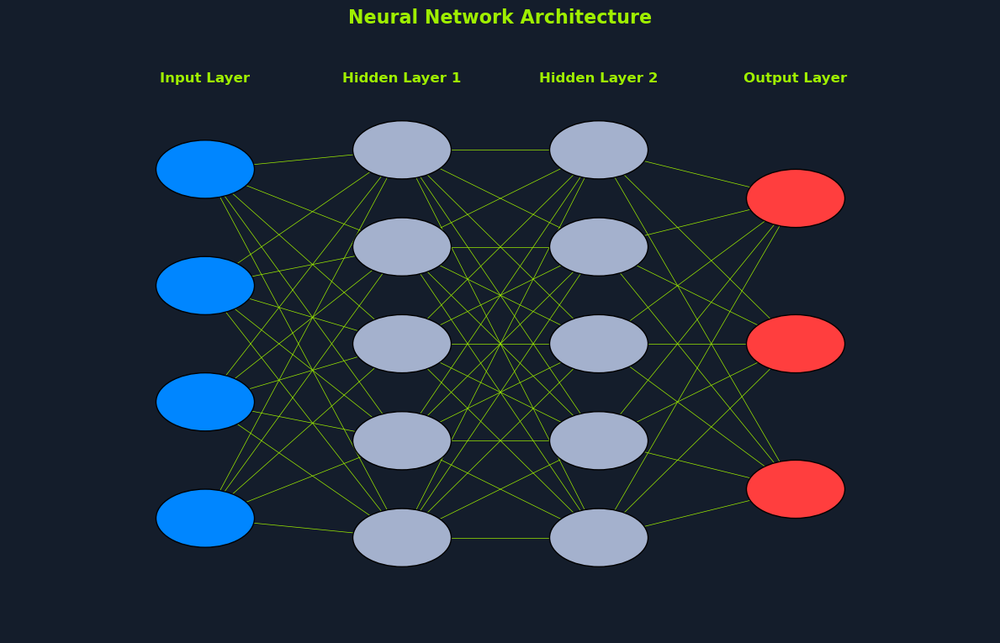

# Neural Networks


*Neural Network Architecture: Three blue input nodes, two hidden layers with three nodes each, and three red output nodes, all fully connected.*

## Overview

To overcome the limitations of single-layer perceptrons, we introduce the concept of **neural networks with multiple layers**. These networks, also known as **multi-layer perceptrons (MLPs)**, represent a significant advancement in artificial intelligence.

---

## Architecture of Multi-Layer Neural Networks

Multi-layer perceptrons (MLPs) are composed of:

### 1. Input Layer
- **Entry point** for the data
- Receives raw features
- No computation, just passes data forward

### 2. One or More Hidden Layers
- **Intermediate processing** layers
- Extract and transform features
- Learn hierarchical representations
- Enable non-linear learning

### 3. Output Layer
- **Final layer** producing predictions
- Number of neurons depends on task
- Uses appropriate activation for output type

---

## Why Multiple Layers Matter

**Key advancement over single-layer perceptrons:**

| Feature | Single-Layer Perceptron | Multi-Layer Neural Network |
|---------|------------------------|---------------------------|
| **Decision Boundary** | Linear only | Non-linear, complex |
| **XOR Problem** | ❌ Cannot solve | ✅ Can solve |
| **Feature Learning** | Manual features | Automatic hierarchical features |
| **Complexity** | Simple patterns | Complex patterns |
| **Applications** | Limited | Extensive |

**Breakthrough capability:**
- Can learn **non-linear decision boundaries**
- Solves problems that are **not linearly separable**
- Foundation of modern **deep learning**

---

## Neurons: The Building Blocks

A **neuron** (also called a node or unit) is a fundamental computational unit in neural networks.

### What is a Neuron?

**Definition:** A computational unit that receives inputs, processes them using weights and a bias, and applies an activation function to produce an output.

### Neuron Components

**A neuron performs these operations:**

1. **Receives inputs**: x₁, x₂, ..., xₙ (from previous layer)
2. **Applies weights**: w₁, w₂, ..., wₙ (learned parameters)
3. **Computes weighted sum**: z = Σ(wᵢ * xᵢ) + b
4. **Applies activation function**: a = f(z)
5. **Produces output**: Sends a to next layer

**Mathematical representation:**
```python
z = w₁*x₁ + w₂*x₂ + ... + wₙ*xₙ + b
output = f(z)
```

---

## Neurons vs Perceptrons

### Perceptron (Original)
- Uses **step function** for activation
- Binary output (0 or 1)
- Limited to linear separation
- Simple threshold-based decision

### Neuron (Modern)
- Uses **various activation functions** (sigmoid, ReLU, tanh, etc.)
- Can produce **continuous outputs**
- Handles **non-linear relationships**
- More flexible and powerful

---

## Flexibility of Neurons

**This flexibility allows neurons to:**

✅ Handle **non-linear relationships** in data
✅ Produce **continuous outputs** (not just binary)
✅ Learn **complex patterns** through composition
✅ Suitable for **various tasks**:
- Regression (continuous prediction)
- Classification (discrete categories)
- Probability estimation
- Feature extraction

**Key insight:** The ability to use different activation functions makes neurons far more versatile than basic perceptrons.

---

## Input Layer


*Neural network diagram: Input layer with features 1, 2, 3 connected to neurons 1 and 2. Weighted sum plus bias passed to hidden layer 1 with activation function, leading to output.*

### Purpose

The **input layer** serves as the **entry point** for the data into the neural network.

---

## Characteristics

**Structure:**
- Each neuron in the input layer corresponds to a **feature or attribute** of the input data
- Number of input neurons = number of features in the data
- No computation occurs in the input layer
- Simply passes data to the first hidden layer

**Role:**
- Receives raw input data
- Distributes features to the network
- No weights or activation functions
- Acts as data interface

---

## Examples

### Image Input (28×28 grayscale image)
```
Input layer: 784 neurons (28 × 28 pixels)
Each neuron represents one pixel's brightness (0-255)
```

### Tabular Data (House features)
```
Input layer: 10 neurons
x₁ = square footage
x₂ = number of bedrooms
x₃ = number of bathrooms
x₄ = age of house
x₅ = lot size
... (5 more features)
```

### Text Data (Bag of words)
```
Input layer: 10,000 neurons (vocabulary size)
Each neuron represents word frequency in document
```

---

## Data Flow

**From input layer:**

```
Input Data → Input Layer → Hidden Layer 1 → ... → Output
   [x₁]        [x₁]           [h₁]
   [x₂]        [x₂]           [h₂]
   [x₃]   →    [x₃]      →    [h₃]    →  ...
   [x₄]        [x₄]           [h₄]
```

**Key point:** The input layer doesn't transform data; it just **passes the features** to the first hidden layer where actual computation begins.

---

## Hidden Layers


*Neural network with three hidden layers. Each layer has neurons performing weighted sum plus bias, followed by activation function, leading to output.*

### Purpose

**Hidden layers** are the intermediate layers between the input and output layers. They are called "hidden" because they are not directly observable from the input or output of the network.

---

## What Hidden Layers Do

Hidden layers **perform computations and extract features** from the data. This is where the network learns to represent the input in increasingly abstract ways.

### Computation at Each Neuron

Each neuron in a hidden layer:

**1. Receives input from all neurons in the previous layer**
```python
inputs = [a₁, a₂, ..., aₙ]  # Outputs from previous layer
```

**2. Performs a weighted sum of the inputs**
```python
z = w₁*a₁ + w₂*a₂ + ... + wₙ*aₙ
```

**3. Adds a bias to the sum**
```python
z = z + b
```

**4. Applies an activation function to the result**
```python
a = f(z)  # Where f is the activation function (ReLU, sigmoid, etc.)
```

**5. Passes output to the next layer**
```python
output = a  # Sent as input to next layer
```

---

## Complete Neuron Formula

**For a single neuron in a hidden layer:**

```python
z = Σ(wᵢ * aᵢ) + b
a = f(z)
```

**Where:**
- **z**: Pre-activation (weighted sum + bias)
- **aᵢ**: Activations from previous layer
- **wᵢ**: Weights (learned parameters)
- **b**: Bias (learned parameter)
- **f**: Activation function (ReLU, sigmoid, tanh, etc.)
- **a**: Activation (output of this neuron)

---

## Hierarchical Feature Learning

**Multiple hidden layers allow the network to learn complex non-linear relationships** within the data.

### Feature Hierarchy

Each layer can learn **different levels of abstraction**:

**Example: Image Recognition**

| Layer | Features Learned | Description |
|-------|------------------|-------------|
| **Layer 1** | Edges, gradients | Simple visual primitives |
| **Layer 2** | Corners, curves | Combinations of edges |
| **Layer 3** | Simple shapes | Parts like eyes, ears |
| **Layer 4** | Object parts | Complex structures |
| **Layer 5** | Complete objects | Full faces, cars, etc. |

---

### Progressive Abstraction

```
Raw Input → [Hidden 1] → [Hidden 2] → [Hidden 3] → Output
  Pixels     Low-level    Mid-level    High-level   Decision
             features     features     features
```

**Visualization:**

**Input:** Raw pixel data (e.g., image of a dog)

**Hidden Layer 1:** Detects edges, colors, textures
- Horizontal edges
- Vertical edges
- Diagonal edges
- Color gradients

**Hidden Layer 2:** Combines low-level features into patterns
- Curves
- Corners
- Simple shapes
- Texture patterns

**Hidden Layer 3:** Recognizes object parts
- Dog ears
- Dog nose
- Dog eyes
- Fur patterns

**Output:** Classification
- "Dog" with 95% confidence

---

## Why Depth Matters

**Initial layers learn simple features:**
- Basic patterns
- Low-level representations
- General-purpose features

**Subsequent layers combine features:**
- More complex representations
- Task-specific features
- Higher-level abstractions

**Benefits of multiple hidden layers:**

✅ **Hierarchical representations**: Learn features at multiple levels
✅ **Non-linearity**: Each layer adds non-linear transformations
✅ **Feature reuse**: Early layers learn general features
✅ **Expressiveness**: Can approximate very complex functions
✅ **Abstraction**: Automatically discovers relevant patterns

---

## How Many Hidden Layers?

**Guidelines:**

**Shallow networks (1-2 hidden layers):**
- Simple problems
- Small datasets
- When interpretability is important

**Deep networks (3+ hidden layers):**
- Complex problems
- Large datasets
- Image recognition, NLP
- When performance is priority

**Modern deep learning:**
- Image models: 50-200+ layers (ResNet, VGG)
- Language models: 12-96+ layers (BERT, GPT)
- Video models: 100+ layers

---

## Network Connectivity

**Fully connected (dense) layers:**
- Each neuron connects to **all neurons** in the previous layer
- Most common in MLPs
- Maximum information flow

**Example:**
```
Layer L-1: 3 neurons
Layer L: 4 neurons
Connections: 3 × 4 = 12 weighted connections
```

**For a layer with:**
- **n** input neurons
- **m** output neurons
- **Parameters**: n × m weights + m biases

---

## Output Layer


*Diagram of classification output layers: Multi-class with three neurons using Softmax activation for class results; Binary with one neuron using Sigmoid activation for result.*

### Purpose

The **output layer** produces the network's **final result**. It's the last layer that transforms the network's internal representations into the desired output format.

---

## Output Layer Configuration

The **number of neurons** in the output layer depends on the specific task:

### Binary Classification

**Task:** Classify into one of two categories (Yes/No, True/False, 0/1)

**Configuration:**
- **Number of neurons**: 1
- **Activation function**: Sigmoid
- **Output**: Probability of positive class (0 to 1)

**Interpretation:**
```python
if output > 0.5:
    prediction = "Positive Class"
else:
    prediction = "Negative Class"
```

**Examples:**
- Email: Spam or Not Spam
- Medical: Disease Present or Absent
- Finance: Fraud or Legitimate

---

### Multi-Class Classification

**Task:** Classify into one of multiple mutually exclusive categories

**Configuration:**
- **Number of neurons**: One for each class (k neurons for k classes)
- **Activation function**: Softmax
- **Output**: Probability distribution over all classes (sums to 1)

**Example: Digit Recognition (0-9)**
```
Output layer: 10 neurons
Output: [0.01, 0.02, 0.05, 0.7, 0.1, 0.05, 0.03, 0.02, 0.01, 0.01]
         ↑                           ↑
        Digit 0                   Digit 3 (highest probability)
Prediction: 3 (70% confidence)
```

**Examples:**
- Handwritten digit recognition (10 classes: 0-9)
- Animal classification (Cat, Dog, Bird, Fish)
- Language identification (English, Spanish, French, etc.)

---

### Regression

**Task:** Predict continuous values

**Configuration:**
- **Number of neurons**: 1 (for single-output) or multiple (for multi-output)
- **Activation function**: Linear (no activation) or ReLU
- **Output**: Continuous numerical values

**Examples:**
- **Single output**: House price prediction ($150,000 to $1,000,000)
- **Multiple outputs**: Stock price prediction (open, high, low, close)

---

### Multi-Label Classification

**Task:** Assign multiple labels simultaneously (not mutually exclusive)

**Configuration:**
- **Number of neurons**: One for each possible label
- **Activation function**: Sigmoid (for each output independently)
- **Output**: Independent probabilities (don't sum to 1)

**Example: Image Tagging**
```
Output layer: 5 neurons (5 possible tags)
Output: [0.9, 0.1, 0.8, 0.3, 0.7]
         ↑         ↑         ↑
      Person     Sky    Outdoor
Prediction: ["Person", "Sky", "Outdoor"]  # All with probability > 0.5
```

---

## Output Layer Summary

| Task Type | Neurons | Activation | Output Interpretation |
|-----------|---------|------------|----------------------|
| **Binary Classification** | 1 | Sigmoid | Probability (0-1) |
| **Multi-class Classification** | K (classes) | Softmax | Probability distribution |
| **Regression** | 1 or more | Linear/ReLU | Continuous value(s) |
| **Multi-label Classification** | L (labels) | Sigmoid | Independent probabilities |

**Key principle:** The output layer configuration must match the problem type and desired output format.

---

## The Power of Multiple Layers

Multi-layer perceptrons (MLPs) **overcome the limitations of single-layer perceptrons** primarily by learning **non-linear decision boundaries**.

---

## Why Multiple Layers are Powerful

### 1. Non-Linear Decision Boundaries

**Single-layer perceptron:**
- Can only learn **linear** decision boundaries
- Limited to straight lines (2D) or hyperplanes (higher dimensions)
- Cannot solve XOR problem

**Multi-layer perceptron:**
- Can learn **non-linear** decision boundaries
- Can create curves, circles, complex shapes
- Solves XOR and much more

---

### Visual Comparison

**Linear boundary (single layer):**
```
   |  ●    ○
   |    ○    ●
   |  ●    ○
   |────────────  ← Straight line only
```
❌ Cannot separate interleaved classes

**Non-linear boundary (multiple layers):**
```
   |  ●  ╱─╲  ○
   |    ●   ● 
   |  ●  ╲─╱  ○
   |────────────  ← Curved boundary
```
✅ Can separate complex patterns

---

## 2. Universal Approximation Theorem

**Theoretical foundation:**

A neural network with:
- At least **one hidden layer**
- Sufficient number of **neurons**
- Non-linear **activation functions**

Can approximate **any continuous function** to arbitrary precision.

**What this means:**
- MLPs are theoretically capable of learning any pattern
- Given enough neurons and data
- Practical breakthrough for machine learning

---

## 3. Hierarchical Feature Composition

**How MLPs learn complex patterns:**

**Layer by layer composition:**
```
Input → [Layer 1] → [Layer 2] → [Layer 3] → Output
        Simple       Medium      Complex      Decision
        features     features    features
```

**Example: Solving XOR**

**Layer 1 neurons:**
- Neuron 1 learns: x₁ OR x₂
- Neuron 2 learns: x₁ AND x₂

**Layer 2 (output):**
- Combines: (x₁ OR x₂) AND NOT(x₁ AND x₂)
- Result: XOR function! ✅

**Breakthrough:** By **incorporating multiple hidden layers with non-linear activation functions**, MLPs can:
- Approximate complex functions
- Capture intricate patterns in data
- Handle data that is **not linearly separable**

---

## 4. Solving the XOR Problem

**Recall:** Single-layer perceptrons **cannot** solve XOR.

**Multi-layer solution:**

```python
# Architecture
Input (2) → Hidden (2) → Output (1)

# Learned representation
Hidden Layer:
  h1 = ReLU(x1 + x2 - 0.5)      # OR-like
  h2 = ReLU(x1 + x2 - 1.5)      # AND-like

Output Layer:
  y = Sigmoid(h1 - 2*h2 - 0.5)  # XOR
```

**Verification:**

| x₁ | x₂ | h₁ (OR) | h₂ (AND) | y (XOR) |
|----|----|---------|---------| --------|
| 0  | 0  | 0       | 0       | 0 ✅ |
| 0  | 1  | 1       | 0       | 1 ✅ |
| 1  | 0  | 1       | 0       | 1 ✅ |
| 1  | 1  | 1       | 1       | 0 ✅ |

**Success!** Multiple layers solve what was impossible for a single layer.

---

## 5. Greater Expressiveness

**Expressiveness** = ability to represent complex functions

**Comparison:**

**Single layer:**
- Can represent: Linear functions
- Decision boundary: Straight line/hyperplane
- Capacity: Limited

**Multiple layers:**
- Can represent: Highly non-linear functions
- Decision boundary: Complex shapes
- Capacity: Very high (grows exponentially with depth)

**Mathematical insight:**
- With **L layers** and **n neurons per layer**
- Can create up to **O(n^L)** distinct regions
- Exponential growth in representational power

---

## 6. Improved Performance Across Tasks

**MLPs enable success in:**

✅ **Complex classification**
- Handwritten digit recognition
- Object detection
- Medical diagnosis

✅ **Non-linear regression**
- House price prediction with interactions
- Weather forecasting
- Financial modeling

✅ **Pattern recognition**
- Speech recognition
- Image segmentation
- Anomaly detection

✅ **Feature learning**
- Automatic feature extraction
- Dimensionality reduction
- Representation learning

---

## Summary: Power of Multiple Layers

**Key advantages:**

1. ✅ **Non-linear decision boundaries** - Handle complex patterns
2. ✅ **Universal approximation** - Can learn any continuous function
3. ✅ **Hierarchical features** - Automatic feature composition
4. ✅ **XOR problem solved** - Overcomes perceptron limitations
5. ✅ **Greater expressiveness** - Exponentially more powerful
6. ✅ **Improved performance** - Better results on real-world tasks

**The breakthrough:**
> Multiple layers with non-linear activations transform neural networks from limited linear classifiers into powerful universal function approximators.

This is the foundation of **deep learning** and modern AI.

---

## Activation Functions

**Activation functions** play a crucial role in neural networks by introducing **non-linearity**. They determine a neuron's output based on its input.

---

## Why Activation Functions Matter

### Without Activation Functions

**Problem:** The network would essentially be a **linear model**.

**Why:**
```python
# Layer 1
h = W1*x + b1

# Layer 2 (no activation)
y = W2*h + b2
y = W2*(W1*x + b1) + b2
y = (W2*W1)*x + (W2*b1 + b2)
y = W*x + b  # Still just linear!
```

**Result:**
- Multiple layers collapse to a **single linear transformation**
- No benefit from depth
- Cannot learn complex patterns
- Limited to linear separation

---

### With Activation Functions

**Solution:** Non-linear activations break the linearity.

```python
# Layer 1
h = f(W1*x + b1)  # Non-linear!

# Layer 2
y = g(W2*h + b2)  # Non-linear!

# Result: Truly non-linear function
# Cannot be reduced to simple W*x + b
```

**Result:**
✅ Each layer adds **non-linear transformations**
✅ Network can learn **complex patterns**
✅ Depth provides **genuine advantages**
✅ Can solve **non-linearly separable problems**

---

## How Activation Functions Work

**At each neuron in a hidden layer:**

**1. Neuron receives weighted sum:**
```python
z = w₁*a₁ + w₂*a₂ + ... + wₙ*aₙ + b
```
Where a₁, a₂, ..., aₙ are inputs from the previous layer.

**2. Weighted sum passed through activation function:**
```python
a = f(z)  # Activation function
```

**3. Activation function determines output:**
- Whether the neuron should be "activated"
- To what extent it fires
- What value it passes to the next layer

**4. Output passed as input to next layer:**
```python
next_layer_input = a
```

---

## Role of Activation Functions

**Purpose:**

✅ **Introduce non-linearity** - Enable learning complex patterns
✅ **Control neuron activation** - Determine firing behavior  
✅ **Bound outputs** - Keep values in manageable ranges
✅ **Enable gradient flow** - Allow backpropagation to work

---

## Types of Activation Functions

There are various activation functions, each with its own **characteristics and applications**.

### 1. Sigmoid Function

**Formula:**
```python
σ(z) = 1 / (1 + e^(-z))
```

**Graph:**
```
  1 │     ╱─────
    │   ╱
0.5 │  ╱
    │ ╱
  0 │╱───────
    └─────────
```

**Characteristics:**
- **Output range**: (0, 1)
- **Shape**: S-curve
- **Smooth**: Differentiable everywhere
- **Interpretation**: Can represent probabilities

**Advantages:**
- ✅ Clear predictions (outputs close to 0 or 1)
- ✅ Smooth gradient
- ✅ Good for probability outputs

**Disadvantages:**
- ⚠️ **Vanishing gradient problem**: Gradients near 0 at extremes
- ⚠️ Not zero-centered (slows learning)
- ⚠️ Computationally expensive (exponential)
- ⚠️ Saturated neurons stop learning

**Usage:**
- **Historical**: Popular in older networks
- **Current**: Mainly for output layer in binary classification
- **Hidden layers**: Rarely used anymore (replaced by ReLU)

---

### 2. ReLU (Rectified Linear Unit)

**Formula:**
```python
ReLU(z) = max(0, z)
```

**Graph:**
```
    │    ╱
    │   ╱
    │  ╱
    │ ╱
────┼╯─────
    │
```

**Characteristics:**
- **Output range**: [0, ∞)
- **Shape**: Linear for positive, zero for negative
- **Piecewise linear**
- **Simple**: Just max(0, z)

**Advantages:**
- ✅ **Computationally efficient**: Simple operation
- ✅ **No vanishing gradient** (for positive values)
- ✅ **Sparse activation**: Many neurons output 0
- ✅ **Accelerates convergence**: Faster training
- ✅ **Biological plausibility**: Similar to neuron behavior

**Disadvantages:**
- ⚠️ **"Dying ReLU" problem**: Neurons can get stuck outputting 0
- ⚠️ Not differentiable at z=0 (though not an issue in practice)
- ⚠️ Unbounded output (can grow very large)

**Usage:**
- **Most popular** activation for hidden layers
- **Default choice** in modern deep learning
- Used in CNNs, fully connected networks
- Foundation of deep learning success

**Why so popular:**
- Overcame vanishing gradient problem
- Enabled training of very deep networks
- Simple yet effective

---

### 3. Tanh (Hyperbolic Tangent)

**Formula:**
```python
tanh(z) = (e^z - e^(-z)) / (e^z + e^(-z))
```

**Or:**
```python
tanh(z) = 2*σ(2z) - 1
```

**Graph:**
```
  1 │     ╱─────
    │   ╱
  0 │  ╱
    │ ╱
 -1 │╱───────
    └─────────
```

**Characteristics:**
- **Output range**: (-1, 1)
- **Shape**: S-curve centered at 0
- **Zero-centered**: Unlike sigmoid
- **Smooth**: Differentiable everywhere

**Advantages:**
- ✅ **Zero-centered**: Better for optimization
- ✅ Stronger gradients than sigmoid
- ✅ Good for hidden layers (better than sigmoid)

**Disadvantages:**
- ⚠️ Still suffers from vanishing gradient
- ⚠️ Computationally expensive
- ⚠️ Saturates at extremes

**Usage:**
- **RNNs and LSTMs**: Common in recurrent architectures
- **Hidden layers**: When zero-centered output beneficial
- **Legacy architectures**: Used before ReLU dominance
- **Less common now**: Replaced by ReLU in most cases

---

### 4. Softmax Function

**Formula:**
```python
softmax(zᵢ) = e^(zᵢ) / Σⱼ e^(zⱼ)
```

**For a vector z = [z₁, z₂, ..., zₖ]:**
```python
softmax(z) = [e^z₁/S, e^z₂/S, ..., e^zₖ/S]
where S = e^z₁ + e^z₂ + ... + e^zₖ
```

**Characteristics:**
- **Output range**: (0, 1) for each element
- **Sum to 1**: Σ softmax(zᵢ) = 1
- **Probability distribution**: Outputs interpretable as probabilities
- **Relative comparison**: Emphasizes larger values

**Example:**
```python
Input:  z = [2.0, 1.0, 0.1]
Output: softmax(z) = [0.659, 0.242, 0.099]
                      ↑
                   Highest probability
```

**Advantages:**
- ✅ Produces valid probability distribution
- ✅ Differentiable (good for backpropagation)
- ✅ Emphasizes maximum value
- ✅ Clear interpretation as class probabilities

**Disadvantages:**
- ⚠️ Computationally expensive
- ⚠️ Can suffer from numerical instability (solved with normalization)
- ⚠️ Only for output layer

**Usage:**
- **Output layer** for multi-class classification
- **Always used** when predicting one of K classes
- **Never** in hidden layers (use ReLU instead)

**Common pairing:**
- Softmax activation + Categorical Cross-Entropy loss

---

## Activation Function Comparison Table

| Function | Range | Zero-Centered | Vanishing Gradient | Speed | Primary Use |
|----------|-------|---------------|-------------------|-------|-------------|
| **Sigmoid** | (0,1) | ❌ | Yes | Slow | Output (binary) |
| **Tanh** | (-1,1) | ✅ | Yes | Slow | RNNs, legacy |
| **ReLU** | [0,∞) | ❌ | No (x>0) | Fast | **Hidden layers** |
| **Softmax** | (0,1), Σ=1 | ❌ | Varies | Medium | Output (multi-class) |

---

## Choosing Activation Functions

**General guidelines:**

### For Hidden Layers:
**Default choice: ReLU**
```python
hidden = ReLU(W*x + b)
```

**Alternatives:**
- **Leaky ReLU**: If dying ReLU is a problem
- **ELU**: For improved learning
- **Tanh**: For RNNs or when zero-centered needed

### For Output Layer:

**Binary classification:**
```python
output = Sigmoid(W*h + b)  # Probability of positive class
```

**Multi-class classification:**
```python
output = Softmax(W*h + b)  # Probability distribution
```

**Regression:**
```python
output = W*h + b  # Linear (no activation)
# or
output = ReLU(W*h + b)  # If non-negative output
```

---

## Summary: Activation Functions

**Key points:**

1. **Essential for non-linearity** - Without them, networks are just linear models
2. **Different functions for different layers** - Hidden vs output layers
3. **ReLU dominance** - Most popular for hidden layers in modern deep learning
4. **Task-specific outputs** - Sigmoid/softmax for classification, linear for regression
5. **Historical evolution** - Sigmoid → Tanh → ReLU → Advanced variants

**The choice of activation function depends on:**
- ✅ Layer type (hidden vs output)
- ✅ Specific task (classification vs regression)
- ✅ Network architecture (CNN vs RNN vs MLP)
- ✅ Performance requirements (speed vs accuracy)

**Modern best practice:**
- **Hidden layers**: ReLU (or variants)
- **Output layer**: Task-dependent (sigmoid, softmax, or linear)

---

## Training MLPs

Training a **multi-layer perceptron (MLP)** involves adjusting the network's **weights and biases** to minimize the error between its predictions and target values.

### Training Objective

**Goal:** Find optimal weights W and biases b that minimize prediction error.

**Achieved through:**
1. **Backpropagation** - Calculates gradients
2. **Gradient Descent** - Updates parameters

This process is achieved through a combination of **backpropagation** and **gradient descent**.

---

## Backpropagation


*Flowchart: Start with input data, forward pass to predict output, calculate error with target output, compute loss, perform backward pass, update weights and biases.*

**Backpropagation** is an algorithm for calculating the **gradient of the loss function** concerning the network's weights and biases.

### How Backpropagation Works

It works by **propagating the error signal back through the network**, layer by layer, starting from the output layer.

**Name origin:** "Back" because it propagates errors **backward** through the network.

---

## The Backpropagation Process

Here's a simplified overview:

### Step 1: Forward Pass

**Purpose:** Generate predictions from input data.

**Process:**
- Input data is **fed through the network**
- Each layer computes its output using:
  ```python
  z = W*a_prev + b
  a = f(z)  # Apply activation
  ```
- Continue until output layer
- Final **output is calculated**

**Example:**
```
Input → [Layer 1] → [Layer 2] → Output
  x         h₁          h₂         ŷ
```

**Store:** All intermediate values (z, a) for backpropagation.

---

### Step 2: Calculate Error

**Purpose:** Measure how wrong the prediction is.

**Process:**
- A **loss function** calculates the difference between:
  - **Predicted output** (ŷ)
  - **Actual target value** (y)

**Common loss functions:**

**Regression:**
```python
L = (y - ŷ)²  # Mean Squared Error
```

**Classification:**
```python
L = -[y*log(ŷ) + (1-y)*log(1-ŷ)]  # Binary Cross-Entropy
```

**Example:**
```
Target: y = 1
Prediction: ŷ = 0.7
Error: L = -(1*log(0.7)) = 0.357
```

---

### Step 3: Backward Pass

**Purpose:** Calculate how much each weight contributed to the error.

**Process:**
The **error signal is propagated back** through the network.

**For each layer** (starting from output, going backward):

**1. Calculate gradient of loss with respect to layer output:**
```python
∂L/∂a[L]  # Gradient at output layer
```

**2. Calculate gradient with respect to pre-activation:**
```python
∂L/∂z[L] = ∂L/∂a[L] * f'(z[L])  # Chain rule with activation derivative
```

**3. Calculate gradients for weights and biases:**
```python
∂L/∂W[L] = ∂L/∂z[L] * a[L-1]ᵀ  # Gradient for weights
∂L/∂b[L] = ∂L/∂z[L]             # Gradient for bias
```

**4. Pass gradient to previous layer:**
```python
∂L/∂a[L-1] = W[L]ᵀ * ∂L/∂z[L]  # Propagate backward
```

**5. Repeat for all layers**

---

## Mathematical Foundation: Chain Rule

Backpropagation uses the **chain rule** from calculus:

**Chain rule:**
```
If y = f(u) and u = g(x), then:
dy/dx = (dy/du) * (du/dx)
```

**Applied to neural networks:**
```python
∂L/∂w = ∂L/∂a * ∂a/∂z * ∂z/∂w
```

**For multiple layers:**
```python
∂L/∂W[1] = ∂L/∂a[3] * ∂a[3]/∂z[3] * ∂z[3]/∂a[2] * ∂a[2]/∂z[2] * ∂z[2]/∂a[1] * ∂a[1]/∂z[1] * ∂z[1]/∂W[1]
```

This allows **efficient gradient computation** through multiple layers.

---

### Step 4: Update Weights and Biases

**Purpose:** Improve the network based on calculated gradients.

**Process:**
The weights and biases are **updated to reduce errors**.

This is typically done using an **optimization algorithm** like gradient descent:

```python
W = W - α * ∂L/∂W  # Update weights
b = b - α * ∂L/∂b  # Update biases
```

Where:
- **α**: Learning rate (how big the step is)
- **∂L/∂W**: Gradient of loss with respect to weights
- **∂L/∂b**: Gradient of loss with respect to biases

---

### Complete Backpropagation Cycle

```
1. Forward: x → h₁ → h₂ → ŷ → L(ŷ,y)
2. Backward: ∂L/∂W₁ ← ∂L/∂h₁ ← ∂L/∂h₂ ← ∂L/∂ŷ
3. Update: W₁ = W₁ - α*∂L/∂W₁
```

**Repeat** for all training examples and multiple epochs.

---

## Gradient Descent


*Flowchart: Start, initialize weights and biases, calculate gradient, update weights and biases, check convergence. If no, repeat; if yes, end.*

**Gradient descent** is an iterative optimization algorithm used to find the **minimum of a function**.

### Purpose in MLPs

In the context of MLPs, the goal is to minimize the **loss function**.

---

## How Gradient Descent Works

Gradient descent works by taking **steps toward the negative gradient** of the loss function.

**Intuition:** 
- Imagine you're on a mountain in fog
- You want to reach the valley (minimum)
- You feel the slope under your feet (gradient)
- You step downhill (negative gradient direction)
- Repeat until you reach the bottom

---

## The Gradient Descent Algorithm

### Step 1: Initialize Weights and Biases

**Process:**
Start with **random values** for the weights and biases.

**Common initialization strategies:**
- **Random small values**: W ~ N(0, 0.01)
- **Xavier initialization**: W ~ N(0, 1/n_in)
- **He initialization**: W ~ N(0, 2/n_in) - Good for ReLU

**Why random:**
- Breaks symmetry
- Different neurons learn different features
- Prevents all neurons from learning the same thing

---

### Step 2: Calculate Gradient

**Process:**
Use **backpropagation** to calculate the gradient of the loss function with respect to the weights and biases.

```python
∂L/∂W, ∂L/∂b = backpropagation(X, y, W, b)
```

**Gradient tells us:**
- **Direction**: Which way increases loss
- **Magnitude**: How sensitive loss is to parameter

---

### Step 3: Update Weights and Biases

**Process:**
Subtract a **fraction of the gradient** from the current weights and biases.

**Update rule:**
```python
W = W - α * ∂L/∂W
b = b - α * ∂L/∂b
```

**Where:**
- **α (alpha)**: Learning rate - determines the size of the step
- **∂L/∂W**: Gradient - determines the direction

**The learning rate is crucial:**
- **Too large**: Overshoots minimum, unstable training
- **Too small**: Very slow convergence
- **Just right**: Efficient convergence to minimum

---

### Step 4: Repeat

**Process:**
Repeat steps 2 and 3 until:

**Convergence criteria:**
- Loss function **converges** to a minimum (changes become very small)
- **Predefined number of iterations** (epochs) is reached
- **Validation performance** stops improving (early stopping)
- **Time limit** is exceeded

---

## Variants of Gradient Descent

### 1. Batch Gradient Descent

**Processes:** Entire dataset at once

```python
for epoch in epochs:
    gradient = calculate_gradient(all_data)
    weights = weights - learning_rate * gradient
```

**Advantages:**
- ✅ Stable convergence
- ✅ Guaranteed to converge to minimum (convex functions)

**Disadvantages:**
- ⚠️ Slow for large datasets
- ⚠️ Memory intensive
- ⚠️ Can get stuck in local minima

---

### 2. Stochastic Gradient Descent (SGD)

**Processes:** One example at a time

```python
for epoch in epochs:
    for example in dataset:
        gradient = calculate_gradient(example)
        weights = weights - learning_rate * gradient
```

**Advantages:**
- ✅ Fast updates
- ✅ Can escape local minima
- ✅ Memory efficient

**Disadvantages:**
- ⚠️ Noisy convergence
- ⚠️ May not converge exactly

---

### 3. Mini-Batch Gradient Descent

**Processes:** Small batches of data (most common)

```python
batch_size = 32
for epoch in epochs:
    for batch in create_batches(dataset, batch_size):
        gradient = calculate_gradient(batch)
        weights = weights - learning_rate * gradient
```

**Advantages:**
- ✅ **Balance** between batch and stochastic
- ✅ Efficient use of vectorization
- ✅ Moderate noise helps generalization
- ✅ **Most widely used** in practice

**Typical batch sizes:** 32, 64, 128, 256

---

## Backpropagation + Gradient Descent: The Training Loop

**Complete training process:**

```python
# Initialize
W, b = initialize_parameters()

# Training loop
for epoch in range(num_epochs):
    for batch in data_loader:
        # Forward pass
        predictions = forward_pass(batch.x, W, b)
        
        # Calculate loss
        loss = loss_function(predictions, batch.y)
        
        # Backward pass (Backpropagation)
        gradients = backward_pass(loss, W, b)
        
        # Update parameters (Gradient Descent)
        W = W - learning_rate * gradients.W
        b = b - learning_rate * gradients.b
        
    # Monitor progress
    print(f"Epoch {epoch}: Loss = {loss}")
```

---

## How They Work Together

**Backpropagation and gradient descent work together to train MLPs:**

| Component | Role |
|-----------|------|
| **Backpropagation** | Calculates the gradients (how to improve) |
| **Gradient Descent** | Uses those gradients to update parameters (actually improves) |

**Analogy:**
- **Backpropagation** = Compass (tells you which direction to go)
- **Gradient Descent** = Legs (takes you in that direction)

---

## The Iterative Learning Process

**How the network improves:**

**Iteration 1:**
- Forward: Make predictions (poor at first)
- Calculate: Measure error (high at first)
- Backward: Find gradients
- Update: Adjust weights
- **Result:** Slightly better predictions

**Iteration 2:**
- Forward: Make predictions (slightly better)
- Calculate: Measure error (slightly lower)
- Backward: Find gradients
- Update: Adjust weights
- **Result:** Even better predictions

**Iteration 1000:**
- Forward: Make predictions (much better)
- Calculate: Measure error (much lower)
- Backward: Find gradients (smaller)
- Update: Small adjustments
- **Result:** Near-optimal predictions

---

## Visualization of Learning

```
Loss
 │  ●
 │    ●
 │      ●
 │       ●
 │        ●●
 │          ●●●
 │             ●●●●●───────
 └──────────────────────── Iterations
 
 High error → Gradually decreasing → Converged
```

**This iterative process allows the network to:**
- ✅ Learn from the data
- ✅ Improve its performance over time
- ✅ Discover patterns and relationships
- ✅ Make accurate predictions

---

## Training Challenges

**Common issues:**

**Vanishing gradients:**
- Gradients become very small in deep networks
- Solution: Use ReLU, careful initialization

**Exploding gradients:**
- Gradients become very large
- Solution: Gradient clipping, careful learning rate

**Overfitting:**
- Network memorizes training data
- Solution: Dropout, regularization, more data

**Slow convergence:**
- Training takes too long
- Solution: Better optimizer (Adam), learning rate scheduling

---

## Summary

### Key Concepts

**Neural networks:**
- **Multi-layer perceptrons (MLPs)** overcome single-layer limitations
- **Architecture**: Input layer → Hidden layers → Output layer
- **Neurons**: Computational units that apply weighted sum + activation

**Layers:**
- **Input layer**: Entry point for data
- **Hidden layers**: Feature extraction and transformation (enables non-linearity)
- **Output layer**: Final predictions (task-specific)

**Power of multiple layers:**
- ✅ Learn non-linear decision boundaries
- ✅ Solve non-linearly separable problems (like XOR)
- ✅ Hierarchical feature learning
- ✅ Universal approximation capability

**Activation functions:**
- **Purpose**: Introduce non-linearity
- **Common choices**:
  - Hidden layers: ReLU (default)
  - Binary classification output: Sigmoid
  - Multi-class classification output: Softmax
  - Regression output: Linear

**Training process:**

**Backpropagation:**
- Calculates gradients of loss with respect to parameters
- Uses chain rule to propagate errors backward
- Efficient gradient computation

**Gradient Descent:**
- Uses gradients to update weights and biases
- Iterative optimization algorithm
- Minimizes loss function

**Together:**
- Backpropagation finds the direction
- Gradient descent takes the step
- Iterative process improves network performance

### The Breakthrough

Multi-layer neural networks with:
- Multiple layers
- Non-linear activations
- Backpropagation training
- Gradient descent optimization

Enabled the **deep learning revolution** and form the foundation of modern AI systems.

**From limitations to power:**
- Single-layer perceptrons: Limited to linear separation
- Multi-layer networks: Universal function approximators
- Deep learning: State-of-the-art in image, speech, language, and more

Understanding neural networks is essential for grasping modern deep learning architectures like CNNs, RNNs, and Transformers.
