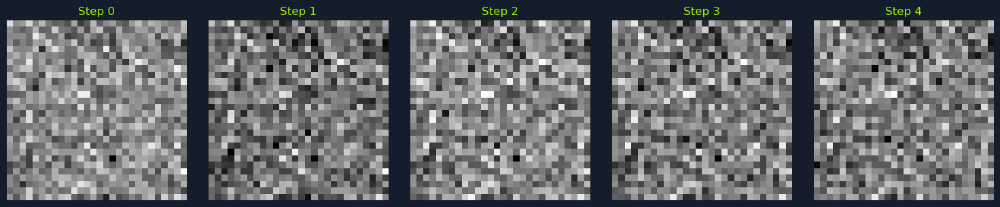
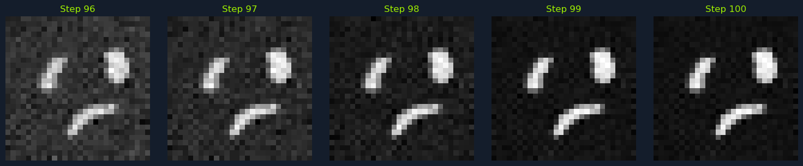
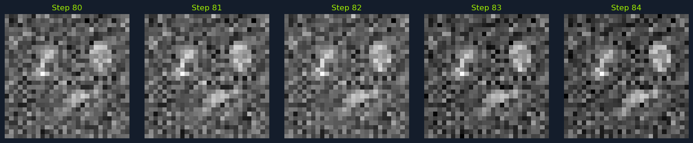
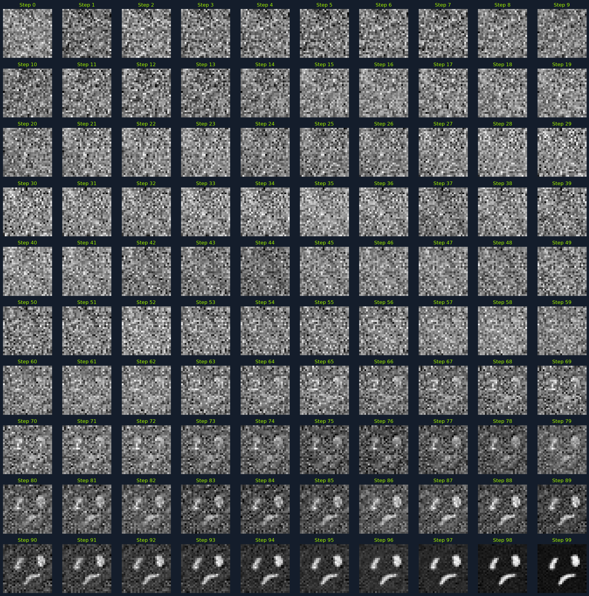

# Diffusion Models

Diffusion models are a class of generative models that have gained significant attention for their ability to generate high-quality images. Unlike traditional generative models like Generative Adversarial Networks (GANs) and Variational Autoencoders (VAEs), diffusion models use noise addition and removal steps to learn the data distribution. This approach has proven effective in generating realistic images, audio, and other data types.

## How Diffusion Models Work


*Cat wearing a colorful hat with a feather, sitting in a room with books and teacups.*

Diffusion models function by gradually adding noise to an input image and then learning to reverse this process to generate new images. However, when generating images based on a textual prompt, such as "a cat in a hat," additional steps are required to incorporate the text into the generation process.

To generate an image from a textual prompt, diffusion models typically integrate a text encoder, such as a Transformer or CLIP, to convert the text into a latent representation. This latent representation then conditions the denoising process, ensuring the generated image aligns with the prompt.

**Text Encoding:** The first step is to encode the textual prompt using a pre-trained text encoder. For example, the prompt "a cat in a hat" is converted into a high-dimensional vector that captures the semantic meaning of the text. This vector serves as a conditioning input for the diffusion model.

**Conditioning the Denoising Process:** The latent representation of the text is used to condition the denoising network. During the reverse process, the denoising network predicts the noise to be removed and ensures that the generated image aligns with the textual prompt. This is achieved by modifying the loss function to include a term that measures the discrepancy between the generated image and the text embedding.

**Sampling Process:** The sampling process begins with pure noise, as in unconditional diffusion models. However, at each step of the reverse process, the denoising network uses both the noisy image and the text embedding to predict the noise. This ensures that the generated image gradually evolves to match the textual description.

**Final Image Generation:** After a sufficient number of denoising steps, the model produces a final image consistent with the given prompt. The iterative process of adding and removing noise, guided by the text embedding, helps the model generate high-quality images that accurately reflect the textual description.

By integrating these steps, diffusion models can effectively generate images from textual prompts, making them powerful tools for text-to-image synthesis, creative content generation, and more. The ability to condition the generation process on text allows diffusion models to produce diverse and contextually relevant images, opening up a wide range of applications in fields like art, design, and content creation.

## Forward Process: Adding Noise


*Five grayscale noise pattern images labeled Step 0 to Step 4.*

The forward process in diffusion models involves gradually adding noise to the data until it becomes pure noise. This process is often called the "forward diffusion" or "noising" process. Mathematically, this can be represented as:

```python
x_T = q(x_T | x_0)
```

Where:

- **x_0** is the original data (e.g., an image).
- **x_T** is the pure noise.
- **q(x_T | x_0)** is the distribution of the noisy data given the original data.

A sequence of intermediate steps typically defines the forward process:

```python
x_t = q(x_t | x_{t-1})
```

Where:

- **t** is the time step, ranging from 0 to T.
- **q(x_t | x_{t-1})** is the transition probability from step t-1 to step t.

## Reverse Process: Removing Noise


*Five grayscale images showing noise patterns labeled Step 96 to Step 100, with emerging shapes.*

The reverse process, known as the "denoising" process, involves learning to remove the noise added during the forward process. The goal is to map the noisy data back to the original data distribution. This is achieved by training a neural network to predict the noise at each step:

```python
x_{t-1} = p_θ(x_{t-1} | x_t)
```

Where:

- **p_θ(x_{t-1} | x_t)** is the learned distribution parameterized by the model's parameters θ.

The reverse process is trained to minimize the difference between the predicted and actual noise added in the forward process. This is typically done using a loss function such as the mean squared error (MSE):

```python
L = E[||ε - ε_pred||^2]
```

Where:

- **ε** is the actual noise.
- **ε_pred** is the predicted noise.

## Noise Schedule


*Five grayscale images showing noise patterns labeled Step 80 to Step 84, with emerging shapes.*

The noise schedule determines how much noise is added at each step of the forward process. A common choice is a linear schedule, where the variance of the noise increases linearly over time:

```python
β_t = β_min + (t / T) * (β_max - β_min)
```

Where:

- **β_t** is the variance of the noise at step t.
- **β_min** and **β_max** are the minimum and maximum variances, respectively.

The choice of the noise schedule can significantly impact the diffusion model's performance. A well-designed schedule ensures the model learns to denoise effectively across all time steps.

## Denoising Network

The denoising network is a neural network that learns to predict the noise at each time step. This network is typically a deep convolutional neural network (CNN) or a transformer, depending on the complexity of the data. The input to the network is the noisy data x_t, and the output is the predicted noise ε̂.

The architecture of the denoising network is crucial for the model's performance. It must be powerful enough to capture the complex patterns in the data and efficient enough to handle large datasets and high-resolution images.

## Training

Training a diffusion model involves minimizing the loss function over multiple time steps. This is done using gradient descent and backpropagation. The training process can be computationally intensive, especially for high-resolution images, but it results in a model that can generate high-quality samples.

The training process can be summarized as follows:

1. **Initialize the Model:** Start with an initial set of parameters θ for the denoising network.
2. **Forward Process:** Add noise to the original data using the noise schedule.
3. **Reverse Process:** Train the denoising network to predict the noise at each time step.
4. **Loss Calculation:** Compute the loss between predicted and actual noise.
5. **Parameter Update:** To minimize the loss, update the model parameters using gradient descent.
6. **Iterate:** Repeat the process for multiple epochs until the model converges.

## Sampling


*Image showing a grid of 100 steps, from 0 to 99, illustrating the gradual transformation of random noise into a clear image of a smiling face.*

Once the model is trained, you can generate new images by sampling from the learned distribution. This involves starting with pure noise and iteratively applying the reverse process to remove the noise:

```python
x_0 = p_θ(x_0 | x_T)
```

Where:

- **x_T** is the initial pure noise.
- **p_θ(x_0 | x_T)** is the learned distribution.

The sampling process can be summarized as follows:

1. **Start with Noise:** Initialize the process with pure noise x_T.
2. **Iterative Denoising:** For each time step t from T to 1, use the denoising network to predict the noise and update the data.
3. **Final Sample:** After T steps, the resulting data x_0 is the generated image.

## Data Assumptions

Diffusion models make the following assumptions about the data:

**Markov Property:** The diffusion process exhibits the Markov property. This means that each step in both the forward (adding noise) and reverse (removing noise) processes depends only on the immediately preceding step, not the entire history of the process.

**Static Data Distribution:** Diffusion models are trained on a fixed dataset, and they learn to represent the underlying distribution of this data. This data distribution is assumed to be static during training.

**Smoothness Assumption:** While not a strict requirement, diffusion models often perform well when the data distribution is smooth. This means that small changes in the input data result in small changes in the output. This assumption helps the model learn the underlying structure of the data and generate realistic samples.
