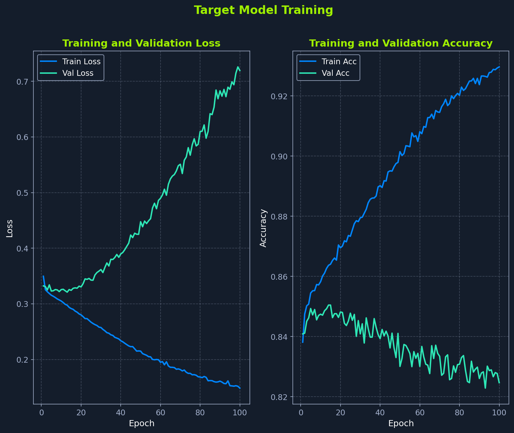
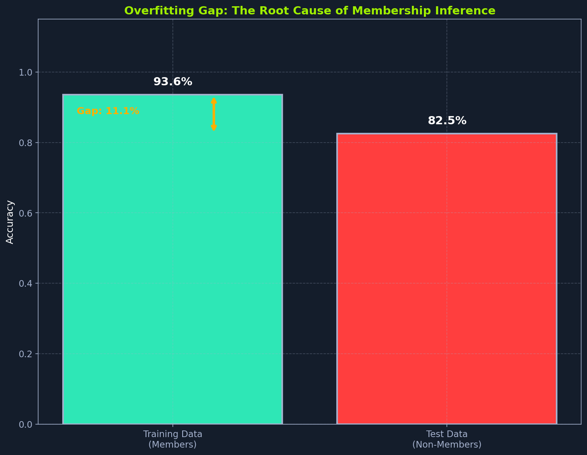

# Section 3 / 21

# Setup Overview
This module uses the `htb_ai_library` package for models, training utilities, data loading, and visualization. This section explains the setup and configuration choices that directly affect attack success.

## Installing Dependencies
This module requires several Python packages for machine learning, privacy-preserving training, and visualization. Install all dependencies within your environment:

```bash
pip install torch torchvision numpy scikit-learn matplotlib tqdm safetensors opacus flask
```

These packages provide:

| Package | Purpose |
|---|---|
| `torch`, `torchvision` | PyTorch deep learning framework and vision utilities |
| `numpy` | Numerical computing and array operations |
| `scikit-learn` | Data preprocessing, metrics, and train/test splitting |
| `matplotlib` | Visualization and plotting |
| `tqdm` | Progress bars for training loops |
| `safetensors` | Secure model weight serialization for challenge submissions |
| `opacus` | Differential privacy for PyTorch (DP-SGD implementation) |
| `flask` | Web API framework used by challenge evaluators |

Next, install the HTB AI library from GitHub. This library provides pre-built models, training utilities, data loaders, and visualization functions used throughout the module:

```bash
pip install --upgrade git+https://github.com/PandaSt0rm/htb-ai-library
```

## Imports and Configuration
Start your training script with the standard library imports and our custom library:

```python
import os
import json
import numpy as np
import torch
import torch.nn.functional as F
from sklearn.model_selection import train_test_split
from sklearn.preprocessing import StandardScaler
from sklearn.metrics import accuracy_score, precision_score, recall_score, f1_score, classification_report
```

Next, import the attack-specific components from our library:

```python
from htb_ai_library import (
    set_reproducibility, use_htb_style,
    MLP, AttackModel,
    load_adult_census,
    train_fixed_epochs, train_with_early_stopping, evaluate_model,
    get_model_predictions, prepare_attack_data, create_dataloader,
    plot_training_history, plot_overfitting_gap, plot_confidence_distributions,
    plot_shadow_confidence_distributions, plot_attack_roc_curve, plot_precision_recall_curve,
    plot_attack_accuracy_comparison, analyze_attack_decision_boundary, plot_decision_boundary,
)
```

Now configure the execution environment. Setting `RANDOM_SEED = 1337` and calling `set_reproducibility()` ensures identical results across runs:

```python
RANDOM_SEED = 1337
DEVICE = torch.device("cuda" if torch.cuda.is_available() else "cpu")
set_reproducibility(RANDOM_SEED)
use_htb_style()
```

Finally, set up output directories for saving models and figures:

```python
OUTPUT_DIR = "output"
MODEL_DIR = f"{OUTPUT_DIR}/models"
FIGS_DIR = "figs"
FIG_PREFIX = "Introduction_"
os.makedirs(MODEL_DIR, exist_ok=True)
os.makedirs(FIGS_DIR, exist_ok=True)

DATASET_CONFIG = {
    "num_classes": 2,
}
```

## Library Components
We import several building blocks from `htb_ai_library` to construct our membership inference attack. Understanding how these components fit together clarifies the attack pipeline before we implement it.

To ensure our experiments produce identical results across runs, we call `set_reproducibility(seed)` at the start of every script. This function configures PyTorch, NumPy, and CUDA random number generators with our chosen seed value. Reproducibility matters because comparing attack performance under different conditions requires eliminating variation from randomness that would confound our measurements.

Two neural network classes power our attack. We use `MLP` (Multi-Layer Perceptron) in dual roles: it becomes both the target model we attack and the shadow models we train to learn membership patterns. When creating an `MLP`, we specify hidden layer sizes, dropout rates, and the number of output classes. We'll call `predict_proba()` to obtain softmax probabilities that our attack will analyze. We configure the target model with a larger architecture `[256, 128]` and zero dropout to maximize overfitting, while shadow models use a smaller `[128, 64]` architecture with moderate dropout since they only need to exhibit similar overfitting behavior.

We build the `AttackModel` to distinguish members from non-members. Its input structure differs from the `MLP`: instead of raw features, it receives prediction probabilities concatenated with one-hot encoded true labels in the format `[prob_class_0, prob_class_1, label_0, label_1]`. This design lets the attack model learn class-specific confidence patterns, since some classes may exhibit stronger overfitting signals than others.

To load our dataset, we call `load_adult_census()`, which fetches the Adult Census dataset from OpenML, preprocesses categorical features, and creates three disjoint splits. We receive scaled numpy arrays ready for training: target training data (members), shadow training data, and attack evaluation data (non-members). This strict separation prevents data leakage that would artificially inflate attack success.

For training, we use two functions depending on our goals. To deliberately overfit the target model, we call `train_fixed_epochs()`, which runs training for a specified number of epochs without early stopping. For shadow models and the attack model, we use `train_with_early_stopping()`, which monitors validation loss and restores the best model weights when training stagnates. Both functions return a history dictionary containing per-epoch training and validation losses and accuracies for visualization.

To measure performance, we call `evaluate_model()` with a trained model and DataLoader, receiving accuracy, predictions, and probability outputs. We use this to compare performance on training data versus test data, revealing the overfitting gap. When we need predictions without setting up DataLoaders manually, we use `get_model_predictions()`, which handles batching and device transfers internally. Pass a trained model and numpy array, receive prediction probabilities back.

To prepare training data for the attack classifier, we call `prepare_attack_data()` with member predictions, non-member predictions, and their true labels. This function constructs feature vectors `[predictions, one_hot_labels]` and binary membership labels (1 for member, 0 for non-member). The output feeds directly into attack model training. We wrap our numpy arrays into PyTorch DataLoaders using `create_dataloader()`, which accepts configurable batch size and shuffling options.

To interpret our results, we use several visualization functions. We call `plot_training_history()` to render dual-panel training curves showing loss and accuracy over epochs for both training and validation sets. The divergence between curves reveals overfitting. To quantify this gap, `plot_overfitting_gap()` creates a bar chart comparing training accuracy (members) versus test accuracy (non-members). The gap between these bars measures the behavioral difference that enables membership inference.

We visualize confidence patterns using `plot_confidence_distributions()`, which overlays histograms of prediction confidence for members versus non-members. Members typically show higher confidence, and the separation between distributions indicates attack potential. A related function, `plot_shadow_confidence_distributions()`, shows these distributions across all shadow models.

Three complementary visualizations evaluate attack performance. We generate the receiver operating characteristic curve using `plot_attack_roc_curve()`, which includes the area under curve (AUC) metric where AUC above 0.5 indicates better-than-random performance. To examine the precision-recall tradeoff (useful when member and non-member classes are imbalanced), we use `plot_precision_recall_curve()`. For a summary view, `plot_attack_accuracy_comparison()` displays a bar chart comparing all metrics against the 0.5 random baseline.

To understand what the attack learned, we use `analyze_attack_decision_boundary()` to probe the attack model and determine confidence thresholds for membership prediction. We then visualize these thresholds with `plot_decision_boundary()`, showing how membership probability varies with prediction confidence for each class.

## Configuration: Maximizing the Overfitting Gap
The attack exploits the behavioral difference between how models treat training data versus unseen data. Our configuration deliberately maximizes this gap:

```python
TARGET_MODEL_CONFIG = {
    "hidden_layers": [256, 128],
    "dropout": 0.0,  # No dropout to maximize overfitting
    "epochs": 100,
    "batch_size": 32,
    "learning_rate": 0.001,
}
```

Zero dropout removes regularization that would prevent memorization. We train for a fixed number of epochs without early stopping to maximize overfitting. This allows the model to continue memorizing training data well past the optimal generalization point. In production, these would be mistakes. For our demonstration, they create a vulnerable model that MIA can exploit.

Shadow models use different settings because they serve a different purpose:

```python
SHADOW_MODEL_CONFIG = {
    "num_shadow_models": 5,
    "hidden_layers": [128, 64],
    "dropout": 0.3,
    "epochs": 100,
    "batch_size": 64,
    "learning_rate": 0.001,
    "early_stopping_patience": 10,
    "shadow_data_size": 0.5,
}
```

Smaller architecture and moderate dropout make shadow models train faster while still exhibiting detectable overfitting patterns. The attack model learns from shadow model behavior, so shadow models need only enough overfitting to generate representative membership signals.

The attack model needs minimal capacity since it learns a relatively simple decision boundary (higher confidence suggests membership):

```python
ATTACK_MODEL_CONFIG = {
    "hidden_layers": [64, 32],
    "dropout": 0.2,
    "epochs": 100,
    "batch_size": 128,
    "learning_rate": 0.001,
    "early_stopping_patience": 15,
}
```

A small architecture `[64, 32]` with light dropout (0.2) prevents the attack model from overfitting to quirks of specific shadow models. The larger batch size (128) provides stable gradients for the simpler 4-dimensional input, and extended patience (15 epochs) allows subtle membership patterns to emerge during training.

## Data Splitting Strategy
Before loading data, we should understand how the dataset is partitioned. The `load_adult_census()` function creates three disjoint datasets:

```
Total Dataset (48,842 samples)
├── Target Training (24,421) → Members we try to identify
└── Holdout (24,421)
    ├── Shadow Training (12,210) → Train shadow models
    └── Attack Evaluation (12,210) → Non-members for final testing
```

This separation is critical. If attack evaluation data overlapped with target training data, we would inflate attack success metrics by testing on samples we already know are members.

## Loading Data
With the data splits understood, we load the Adult Census dataset:

```python
print("Loading Adult Census dataset...")
X_target, y_target, X_shadow, y_shadow, X_attack_eval, y_attack_eval, num_features = load_adult_census(
    random_state=RANDOM_SEED
)

print(f"Dataset loaded: {num_features} features")
print(f"  Target training (members): {len(X_target)} samples")
print(f"  Shadow training: {len(X_shadow)} samples")
print(f"  Attack evaluation (non-members): {len(X_attack_eval)} samples")
```

## Training the Target Model
The target model is the victim we will attack. We train it to deliberately overfit, starting with data preparation:

```python
print("\n" + "=" * 60)
print("Training Target Model")
print("=" * 60)

scaler = StandardScaler()
X_target_norm = scaler.fit_transform(X_target)
X_attack_eval_norm = scaler.transform(X_attack_eval)
```

We fit the `StandardScaler` on target training data and use `transform()` (not `fit_transform()`) on evaluation data. This ensures both datasets use identical normalization parameters.

Next, create DataLoaders without a validation split. We deliberately omit validation because we want maximum overfitting:

```python
train_loader = create_dataloader(X_target_norm, y_target, TARGET_MODEL_CONFIG['batch_size'])
test_loader = create_dataloader(X_attack_eval_norm, y_attack_eval,
                                TARGET_MODEL_CONFIG['batch_size'], shuffle=False)
```

Initialize the target model with zero dropout to remove regularization:

```python
target_model = MLP(
    input_size=num_features,
    hidden_layers=TARGET_MODEL_CONFIG['hidden_layers'],
    num_classes=DATASET_CONFIG['num_classes'],
    dropout=TARGET_MODEL_CONFIG['dropout']
)

print(f"Architecture: {num_features} -> {TARGET_MODEL_CONFIG['hidden_layers']} -> 2")
print(f"Training for {TARGET_MODEL_CONFIG['epochs']} epochs (no early stopping)")
```

Unlike typical training where we'd use early stopping, we intentionally train for the full 100 epochs to maximize overfitting:

```python
history = train_fixed_epochs(
    target_model, train_loader, test_loader,
    device=DEVICE,
    epochs=TARGET_MODEL_CONFIG['epochs'],
    learning_rate=TARGET_MODEL_CONFIG['learning_rate']
)
```

The history dictionary captures per-epoch metrics: training loss, validation loss, training accuracy, and validation accuracy. Watching these diverge over time reveals how the model progressively memorizes training data. By epoch 30-40, training loss typically continues decreasing while validation loss starts climbing, the classic overfitting signature.

Now we quantify the overfitting gap:

```python
train_acc, _, _ = evaluate_model(target_model, train_loader, DEVICE)
test_acc, _, _ = evaluate_model(target_model, test_loader, DEVICE)

print(f"\nTarget Model Performance:")
print(f"  Training Accuracy: {train_acc:.4f}")
print(f"  Test Accuracy:     {test_acc:.4f}")
print(f"  Overfitting Gap:   {train_acc - test_acc:.4f}")

plot_overfitting_gap(train_acc, test_acc,
                     save_path=os.path.join(FIGS_DIR, f"{FIG_PREFIX}overfitting_gap.png"))
```

When training the target model, you will see output like:

```text
Target Model Performance:
  Training Accuracy: 0.9012
  Test Accuracy:     0.8456
  Overfitting Gap:   0.0556
```

This 5.5% gap means the model correctly classifies 90% of training samples but only 85% of unseen samples. The model behaves differently on data it has seen versus data it has not. This behavioral difference, consistent across tens of thousands of samples, provides the statistical foundation for membership inference.

Let's examine how this gap develops over time:



Two line charts showing target model training over 100 epochs. Left panel: training loss decreases from 0.35 to 0.15 while validation loss increases from 0.35 to 0.72, indicating severe overfitting. Right panel: training accuracy rises from 85% to 94% while validation accuracy declines from 85% to 82%.

Notice the divergence around epoch 20: training loss continues decreasing while validation loss starts climbing. Training accuracy reaches 90% while validation accuracy stagnates near 83%. This classic overfitting pattern shows the model memorizing training examples instead of learning generalizable patterns.



Bar chart comparing model accuracy on training data versus test data. Training data (members) achieves 93.6% accuracy shown in green; test data (non-members) achieves 82.5% accuracy shown in red. An arrow highlights the 11.1% gap, illustrating the root cause of membership inference vulnerability.

We can quantify this gap directly: 90.2% accuracy on training data (members) versus 83.2% on test data (non-members). This 7.1% difference represents the vulnerability our attack will exploit. The model treats members and non-members measurably differently.

The next sections use these components to implement the attack: training shadow models to generate labeled membership data, building an attack classifier that learns membership patterns, and executing the attack against the target model.

## Model Architectures
We use the `MLP` class from `htb_ai_library` for both target and shadow models. The key method for our attack is `predict_proba()`:

```python
def predict_proba(self, x):
    logits = self.forward(x)
    return F.softmax(logits, dim=1)
```

This returns calibrated probabilities, not raw logits. The attack analyzes these confidence values because members tend to receive higher-confidence predictions. A member might get `[0.05, 0.95]` while a non-member with identical features gets `[0.15, 0.85]`. This confidence gap is the signal our attack exploits.

The AttackModel class takes a different input structure: prediction probabilities concatenated with one-hot encoded true labels. This design lets the attack model learn class-specific confidence patterns. We cover the exact feature format when we prepare attack training data in the shadow model training section.

