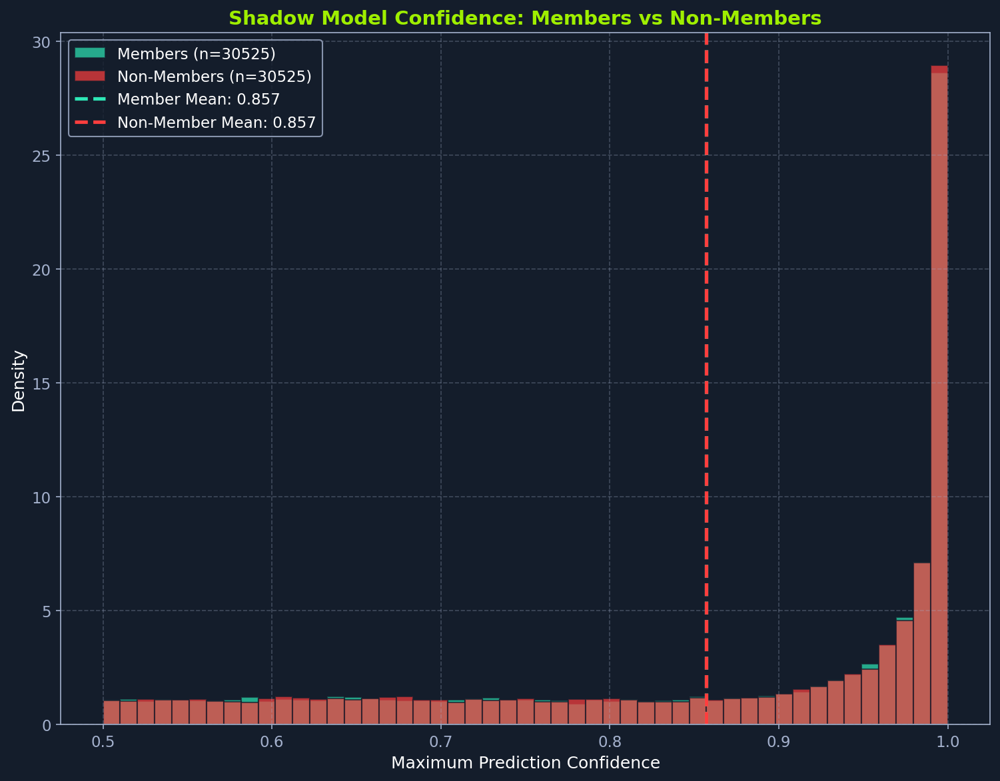

# Section 4 / 21

# Training Shadow Models

The previous sections established why shadow models work and what factors affect attack success. Now we implement the training pipeline. Each shadow model trains on a different random subset of shadow data, and we collect predictions on both member and non-member samples to build the attack training dataset.

We train each shadow model on a different random subset of our shadow data. This diversity matters because training all shadow models on identical data would cause the attack classifier to learn patterns specific to that particular split instead of general membership signals that transfer to the target. Five models strikes the right balance: fewer models produce insufficient diversity in overfitting patterns, causing the attack classifier to memorize artifacts of individual models, while more models provide diminishing returns and increase computational cost linearly.

## Creating Shadow Model Data Splits

```python
print("\n" + "=" * 60)
print("Training Shadow Models")
print("=" * 60)

shadow_splits = []
for i in range(SHADOW_MODEL_CONFIG['num_shadow_models']):
    seed = RANDOM_SEED + i
    X_train_s, X_out_s, y_train_s, y_out_s = train_test_split(
        X_shadow, y_shadow, train_size=SHADOW_MODEL_CONFIG['shadow_data_size'],
        random_state=seed, stratify=y_shadow
    )
    shadow_splits.append((X_train_s, X_out_s, y_train_s, y_out_s))

print(f"\nCreated {len(shadow_splits)} shadow model data splits")
print(f"Samples per shadow model: ~{len(shadow_splits[0][0])} in, ~{len(shadow_splits[0][1])} out")
```

## Training and Collecting Predictions

Now we iterate through each split, training a shadow model and collecting its predictions on both in-training (member) and out-of-training (non-member) samples.

Our task is to accumulate attack training data from all shadow models into combined arrays. Combining data from multiple models (rather than training on each separately) exposes the attack classifier to diverse overfitting patterns, preventing it from memorizing quirks of any single model. The variety acts as implicit regularization, producing an attack that generalizes better to the unseen target model.

We use Python lists instead of pre-allocated NumPy arrays because we don't know the exact sample counts upfront (each shadow model's train/validation split varies slightly). Lists handle dynamic appending efficiently, and we convert to NumPy only after all 5 shadow models complete.

With each shadow model contributing approximately 12,210 samples (6,105 members + 6,105 non-members), we expect around 61,050 total attack training examples. The separate all_preds_in and all_preds_out lists store raw 2D probability arrays (samples, 2) for the confidence distribution visualization, while all_attack_X stores the transformed 4D attack features (samples, 4).

We follow the same lifecycle for each shadow model: normalize its data, create train/validation splits, train with early stopping, and collect predictions on both member and non-member samples. Pay particular attention to normalization for attack transferability. We use the same scaler fitted on target data (calling transform, not fit_transform) so that identical raw feature values produce identical normalized values across all models. If we fitted separate scalers, prediction differences would partly reflect normalization differences instead of pure membership signals.

```python
all_attack_X = []
all_attack_y = []
all_preds_in = []
all_preds_out = []

for i, (X_train_s, X_out_s, y_train_s, y_out_s) in enumerate(shadow_splits):
    print(f"\nTraining Shadow Model {i+1}/{SHADOW_MODEL_CONFIG['num_shadow_models']}")

    # Normalize using target scaler for transferability
    X_train_s_norm = scaler.transform(X_train_s)
    X_out_s_norm = scaler.transform(X_out_s)

    # Create validation split for early stopping
    X_tr_s, X_val_s, y_tr_s, y_val_s = train_test_split(
        X_train_s_norm, y_train_s, test_size=0.2,
        random_state=RANDOM_SEED + i, stratify=y_train_s
    )
    train_loader_s = create_dataloader(X_tr_s, y_tr_s, SHADOW_MODEL_CONFIG['batch_size'])
    val_loader_s = create_dataloader(X_val_s, y_val_s, SHADOW_MODEL_CONFIG['batch_size'], shuffle=False)

    # Initialize and train shadow model
    shadow_model = MLP(
        input_size=num_features,
        hidden_layers=SHADOW_MODEL_CONFIG['hidden_layers'],
        num_classes=DATASET_CONFIG['num_classes'],
        dropout=SHADOW_MODEL_CONFIG['dropout']
    )
    train_with_early_stopping(
        shadow_model, train_loader_s, val_loader_s,
        device=DEVICE,
        epochs=SHADOW_MODEL_CONFIG['epochs'],
        learning_rate=SHADOW_MODEL_CONFIG['learning_rate'],
        patience=SHADOW_MODEL_CONFIG['early_stopping_patience'],
        verbose=False
    )

    # Collect predictions on members and non-members
    preds_in = get_model_predictions(shadow_model, X_train_s_norm, DEVICE)
    preds_out = get_model_predictions(shadow_model, X_out_s_norm, DEVICE)

    # Transform to attack features and accumulate
    attack_X_s, attack_y_s = prepare_attack_data(preds_in, preds_out, y_train_s, y_out_s)
    all_attack_X.append(attack_X_s)
    all_attack_y.append(attack_y_s)
    all_preds_in.append(preds_in)
    all_preds_out.append(preds_out)

    # Verify overfitting gap exists
    full_train_loader_s = create_dataloader(X_train_s_norm, y_train_s,
                                            SHADOW_MODEL_CONFIG['batch_size'], shuffle=False)
    full_out_loader_s = create_dataloader(X_out_s_norm, y_out_s,
                                          SHADOW_MODEL_CONFIG['batch_size'], shuffle=False)
    train_acc_s, _, _ = evaluate_model(shadow_model, full_train_loader_s, DEVICE)
    out_acc_s, _, _ = evaluate_model(shadow_model, full_out_loader_s, DEVICE)
    print(f"  Shadow {i+1} - Train Acc: {train_acc_s:.4f}, Out Acc: {out_acc_s:.4f}")
```

preds_in contains predictions on samples the model optimized for during training (members), while preds_out contains predictions on samples the model never saw (non-members). These two prediction sets exhibit the behavioral difference our attack will learn to detect. Each call to get_model_predictions() returns softmax probability vectors for all samples in the input array. For binary classification, each prediction is a 2-element array like [0.15, 0.85].

## Combining Attack Training Data

With all five shadow models trained and their predictions collected, we now merge the accumulated data into single arrays for attack model training. Each shadow model contributed approximately 12,210 samples (6,105 members + 6,105 non-members), so our combined dataset contains about 61,050 total samples.

We use np.concatenate to stack arrays along the first axis (samples), preserving the feature dimension. The resulting attack_X has shape (61050, 4) and attack_y has shape (61050,). This combined dataset exposes the attack model to diverse overfitting patterns from multiple shadow models, preventing it from overfitting to quirks of any single model.

```python
attack_X = np.concatenate(all_attack_X, axis=0)
attack_y = np.concatenate(all_attack_y, axis=0)

print(f"\nTotal attack training samples: {len(attack_X)}")
print(f"  Members: {np.sum(attack_y == 1)}")
print(f"  Non-members: {np.sum(attack_y == 0)}")
```

The dataset is balanced: roughly 30,525 members and 30,525 non-members. This balance matters because an imbalanced attack dataset would bias the classifier toward the majority class, causing it to predict one label regardless of actual confidence patterns.

## Understanding Attack Features

The attack feature vector structure was introduced in the Setup Overview. Each 4D vector contains softmax probabilities concatenated with one-hot encoded true labels: [prob_0, prob_1, label_0, label_1]. Let's verify the data:

```python
print(f"\nAttack feature dimensions: {attack_X.shape[1]}")
print(f"Example member feature: {attack_X[0].round(3)}")
print(f"Example non-member feature: {attack_X[len(attack_X)//2].round(3)}")
```

We typically see members show higher confidence for the true class (e.g., [0.12, 0.88, 0.0, 1.0]) while non-members with the same true label show lower confidence (e.g., [0.25, 0.75, 0.0, 1.0]). This confidence gap is the signal our attack exploits. As discussed in the first section, our attack model extracts two distinct signals from these features: prediction confidence and prediction correctness. These signals combine to create the membership fingerprint our attack learns to detect.

## Visualizing Shadow Model Behavior

We use plot_shadow_confidence_distributions() to visualize what the membership signal looks like, showing confidence distributions for members versus non-members across all shadow models.

```python
plot_shadow_confidence_distributions(
    all_preds_in, all_preds_out,
    save_path=os.path.join(FIGS_DIR, f"{FIG_PREFIX}shadow_confidence.png")
)
```



Histogram comparing prediction confidence distributions for members versus non-members across shadow models. Both distributions cluster at high confidence (0.85-1.0) with nearly identical means of 0.857, showing substantial overlap. This demonstrates that well-regularized shadow models produce similar confidence for both groups.

The histogram reveals the challenge our attack faces. Both distributions cluster heavily at high confidence values (0.85+) with nearly identical means, often within 0.5% of each other. Because shadow models use dropout regularization and early stopping, they exhibit minimal overfitting and the expected confidence gap essentially disappears. This substantial overlap explains why membership inference on shadow data is difficult: well-regularized models treat members and non-members almost identically. However, the slight distributional differences, especially in the tails, still provide a learnable signal. The attack model will learn to exploit these subtle patterns across the 61,050 training samples.

## Attack Data Statistics

Before moving to attack model training, let's examine the statistics of our attack dataset.

```python
member_confidences = attack_X[attack_y == 1, :2].max(axis=1)
non_member_confidences = attack_X[attack_y == 0, :2].max(axis=1)

print(f"\nAttack Data Statistics:")
print(f"  Member confidence - Mean: {member_confidences.mean():.4f}, Std: {member_confidences.std():.4f}")
print(f"  Non-member confidence - Mean: {non_member_confidences.mean():.4f}, Std: {non_member_confidences.std():.4f}")
print(f"  Confidence gap: {member_confidences.mean() - non_member_confidences.mean():.4f}")
```

The confidence gap (typically 0.03-0.05) represents the signal our attack will amplify. While this difference seems small, it is consistent across tens of thousands of samples. The attack model learns to detect this subtle but reliable pattern.

With our attack training data prepared, the next section builds the attack classifier that learns to distinguish members from non-members based on these prediction patterns.
