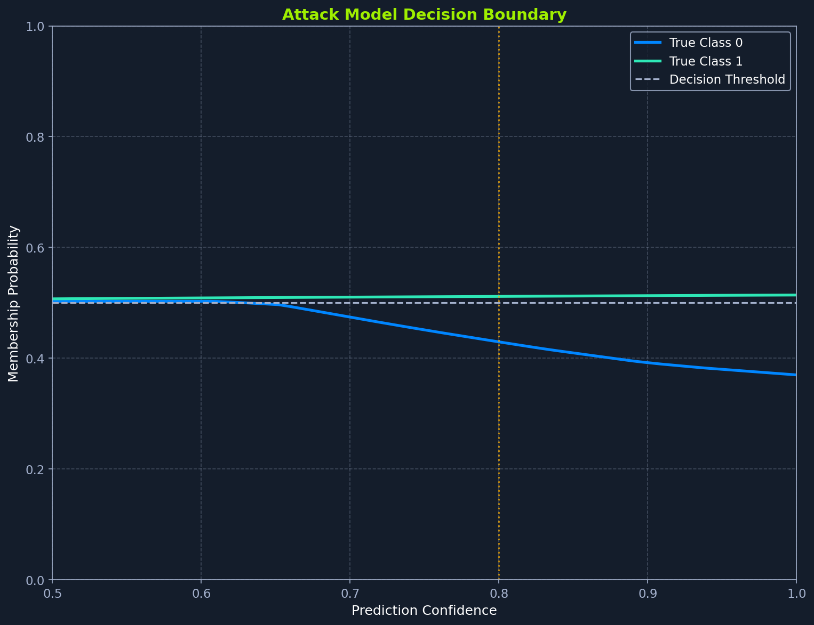

# Section 5 / 21

# Building the Attack Classifier

We now have 61,050 labeled examples of shadow model behavior on members and non-members. The next step is training a classifier that learns to distinguish these two groups based on their prediction patterns. This attack model will then be applied to the target model's predictions to infer membership.

Our attack model must overcome a key generalization challenge: it needs to learn membership patterns from shadow models that transfer to the target model, which has different weights and potentially different overfitting characteristics. If we overfit the attack model to shadow-specific artifacts (peculiarities of individual shadow model training runs), performance on the target will suffer. We address this through three mechanisms: training on diverse data from multiple shadow models, using a small architecture (64, 32 neurons) that cannot memorize shadow-specific patterns, and validating on held-out shadow data to detect overfitting before deployment.

## Splitting Attack Data

We use three splits instead of two because transfer learning requires careful validation. The training set teaches membership patterns, the validation set guides early stopping to prevent memorizing shadow-specific artifacts, and the test set estimates performance on the genuinely unseen target. With only train/test, we'd either overfit to shadow models (no early stopping) or waste valuable data on validation (smaller training set).

We allocate 20% of attack data for testing, approximately 12,210 samples. Stratification ensures both members and non-members are proportionally represented in each split. The test set remains untouched during training, providing an unbiased estimate of attack performance.

We further subdivide the training portion to create a validation set for early stopping. Without validation data, we could not detect when the attack model starts overfitting to the specific shadow model predictions in the training set. We use the same 80/20 split ratio as for other models in our pipeline. This yields approximately 39,072 training samples, 9,768 validation samples, and 12,210 test samples, providing sufficient data at each stage while maintaining held-out test integrity.

We configure a larger batch size of 128 (versus 64 for target/shadow models) because the attack model has fewer parameters and processes smaller input features (4 dimensions versus 14). Larger batches provide more stable gradient estimates and faster training without exceeding memory limits.

```python
print("\n" + "=" * 60)
print("Training Attack Model")
print("=" * 60)

X_attack_train, X_attack_test, y_attack_train, y_attack_test = train_test_split(
    attack_X, attack_y, test_size=0.2, random_state=RANDOM_SEED, stratify=attack_y
)

print(f"\nAttack data split:")
print(f"  Training + Validation: {len(X_attack_train)} samples")
print(f"  Test: {len(X_attack_test)} samples")
```

Now subdivide the training portion to create a validation set for early stopping:

```python
X_attack_tr, X_attack_val, y_attack_tr, y_attack_val = train_test_split(
    X_attack_train, y_attack_train, test_size=0.2, random_state=RANDOM_SEED, stratify=y_attack_train
)

print(f"  Training: {len(X_attack_tr)} samples")
print(f"  Validation: {len(X_attack_val)} samples")
```

Finally, wrap the arrays in DataLoaders. We set shuffle=False for validation and test loaders to ensure consistent evaluation:

```python
attack_train_loader = create_dataloader(X_attack_tr, y_attack_tr, ATTACK_MODEL_CONFIG['batch_size'])
attack_val_loader = create_dataloader(X_attack_val, y_attack_val, ATTACK_MODEL_CONFIG['batch_size'], shuffle=False)
attack_test_loader = create_dataloader(X_attack_test, y_attack_test, ATTACK_MODEL_CONFIG['batch_size'], shuffle=False)

print(f"\nDataLoaders created with batch size {ATTACK_MODEL_CONFIG['batch_size']}")
```

## Attack Model Architecture

The attack model needs minimal capacity. Unlike the target model which must learn complex relationships between 14 demographic features and income, the attack model distinguishes membership from a 4-dimensional input where the primary signal is simply confidence level. A smaller network reduces the risk of overfitting to idiosyncrasies of specific shadow models that wouldn't transfer to the target.

```python
attack_input_size = attack_X.shape[1]
attack_model = AttackModel(
    input_size=attack_input_size,
    hidden_layers=ATTACK_MODEL_CONFIG['hidden_layers'],
    dropout=ATTACK_MODEL_CONFIG['dropout']
)

print(f"\nAttack model architecture: {attack_input_size} -> {ATTACK_MODEL_CONFIG['hidden_layers']} -> 2")
print(f"Dropout: {ATTACK_MODEL_CONFIG['dropout']}")
```

The resulting architecture has only 2,600 parameters: 4×64 + 64 bias = 320 for the first layer, 64×32 + 32 = 2,080 for the second, and 32×2 + 2 = 66 for the output. Compare this to the target model's 37,000 parameters. We use 0.2 dropout (versus 0.3 in shadow models) because the simpler task has less overfitting risk, and we want to preserve signal in the already-small network.

The decision boundary is straightforward: higher confidence suggests membership. The true label conditioning allows class-specific thresholds, but the underlying pattern is simple. A more complex architecture would risk overfitting to noise in the shadow model predictions.

## Training the Attack Model

We train our attack model on the same infrastructure as target and shadow models, using the train_with_early_stopping() function with attack-specific hyperparameters. We set a longer early stopping patience (15 epochs versus 10 for shadow models) to allow more time for the subtle membership patterns to emerge, since the confidence differences we're learning from are smaller than the class differences the classification models learn.

Training typically converges in 20-40 epochs with validation accuracy hovering near 50% throughout. This near-random performance on shadow data is expected: shadow models use dropout regularization and early stopping, which reduces their overfitting and makes member/non-member predictions nearly indistinguishable. The validation accuracy on shadow data does not predict attack performance on the target.

```python
print("\nTraining attack model...")

history_attack = train_with_early_stopping(
    attack_model, attack_train_loader, attack_val_loader,
    device=DEVICE,
    epochs=ATTACK_MODEL_CONFIG['epochs'],
    learning_rate=ATTACK_MODEL_CONFIG['learning_rate'],
    patience=ATTACK_MODEL_CONFIG['early_stopping_patience']
)

plot_training_history(
    history_attack,
    "Attack Model Training",
    save_path=os.path.join(FIGS_DIR, f"{FIG_PREFIX}attack_training.png")
)
```

Two line charts showing attack model training over 50 epochs. Left panel: training and validation loss both decrease marginally from 0.694 to 0.692. Right panel: accuracy fluctuates around 50% throughout training, indicating the model struggles to distinguish members from non-members on shadow data.

Looking at the training curves, we see the subtle nature of membership inference. Loss decreases only marginally (from 0.694 to 0.693), and accuracy hovers around 50-51% throughout training. This near-random performance reflects the weak membership signal in shadow models: their dropout regularization and early stopping produce nearly identical confidence distributions for members and non-members. The attack model learns patterns that barely help on shadow data but will prove more effective on the target, which exhibits stronger overfitting.

## Evaluating Attack Model Performance

Before applying the attack to the target model, we evaluate its performance on held-out shadow model data. The test accuracy measures how well the attack distinguishes members from non-members on shadow model data it never trained on. A typical result of 50-51% accuracy (essentially random guessing) reflects the weak overfitting signal in shadow models. This low accuracy does not indicate failure: the attack model has learned subtle patterns that will prove more effective on the target model, which overfits more strongly.

```python
attack_test_acc, attack_test_predictions, attack_test_probs = evaluate_model(attack_model, attack_test_loader, DEVICE)

print(f"\nAttack Model Test Performance:")
print(f"  Accuracy: {attack_test_acc:.4f}")
print(f"  Samples: {len(attack_test_predictions)}")

print("\nDetailed Classification Report:")
print(classification_report(
    y_attack_test,
    attack_test_predictions,
    target_names=['Non-Member', 'Member'],
    digits=4
))

# Save the attack model
attack_model_path = os.path.join(MODEL_DIR, "attack_model.pt")
torch.save(attack_model.state_dict(), attack_model_path)
print(f"\nAttack model saved to {attack_model_path}")
```

## Detailed Performance Metrics

We examine performance for each class through three complementary metrics. With precision, we ask: of all samples we predicted as members, what fraction actually were members? If precision is 0.70, then 70% of our positive predictions were correct, while 30% were false positives (non-members incorrectly labeled as members). With recall, we ask the inverse: of all actual members, what fraction did we correctly identify? If recall is 0.85, we detected 85% of true members, while 15% escaped detection as false negatives. The F1 score gives us the harmonic mean of precision and recall, providing a single metric that penalizes extreme imbalances between the two.

Different applications prioritize different metrics based on their goals. Privacy audits emphasize recall to find all members even at the cost of false accusations, while legal contexts prioritize precision to avoid wrongly labeling someone as a training member. The relative values of precision and recall reveal the attack's bias: higher recall with lower precision means the attack aggressively labels samples as members, catching most true members but also generating false positives.

The saved file is small (about 20KB) because the attack model has only approximately 2,600 parameters. This compact size reflects the simplicity of the membership classification task compared to the original income prediction task. Unlike the target model save, we don't create a dictionary with multiple components. A single state_dict() suffices because the attack model needs no scaler or auxiliary data for inference.

## Understanding What the Attack Learned

The attack model essentially learned a confidence threshold with class-specific adjustments. We can examine its decision boundary by looking at predictions across the confidence range using analyze_attack_decision_boundary().

```python
boundary_analysis = analyze_attack_decision_boundary(attack_model, DEVICE)

print("\nDecision Boundary Analysis:")
for cls, data in boundary_analysis.items():
    threshold_idx = np.argmin(np.abs(data['membership_probs'] - 0.5))
    threshold_conf = data['confidences'][threshold_idx]
    print(f"  Class {cls}: Membership threshold at confidence ~{threshold_conf:.3f}")
```

Running this analysis reveals the confidence threshold above which our attack predicts membership. Typical thresholds are around 0.80-0.85: samples with higher confidence are classified as members, lower confidence as non-members. Notice how each class may have different thresholds, reflecting different overfitting patterns for each output class.

## Threshold Selection and Attack Tuning

The attack model outputs a membership probability between 0 and 1. Converting this to a binary decision requires choosing a threshold. Our implementation uses 0.5 by default: samples with membership probability above 0.5 are classified as members, below 0.5 as non-members. But this default is not always optimal.

Threshold choice depends on the relative costs of false positives versus false negatives. For privacy auditing, we want to catch all members even if we accidentally flag some non-members; a lower threshold like 0.3 increases recall at the cost of precision. For legal proceedings where false accusations are costly, a higher threshold like 0.7 increases precision at the cost of recall. The ROC curve we generate later shows attack performance across all possible thresholds, letting us choose the operating point that matches our goals.

Finding the best threshold can use different approaches. One uses the validation set: try thresholds from 0.1 to 0.9 in steps of 0.05, compute F1 score for each, and select the threshold with highest F1. Another considers class balance: with 2:1 member to non-member ratio in our evaluation set, the 0.5 threshold tends to favor predicting membership because most samples are members. Adjusting the threshold to 0.6 or 0.7 can improve balanced accuracy.

The attack model we train implicitly learns a threshold through its final layer bias. During training on balanced shadow data, it learns decision boundaries appropriate for 50/50 class balance. When we evaluate on imbalanced data (more members than non-members), the learned boundaries may not be optimal. This is why precision and recall can diverge significantly from each other.

## Visualizing the Decision Boundary

To see how membership probability varies with prediction confidence for each class, we use plot_decision_boundary().

```python
plot_decision_boundary(
    boundary_analysis,
    save_path=os.path.join(FIGS_DIR, f"{FIG_PREFIX}decision_boundary.png")
)
```



Line chart showing attack model decision boundary across prediction confidence levels. True Class 1 (green line) remains flat at 0.5 membership probability. True Class 0 (blue line) decreases from 0.5 to 0.38 as confidence increases, suggesting high-confidence Class 0 predictions are more likely non-members.

We see interesting class-specific patterns in this visualization. For True Class 1 samples (green), membership probability stays nearly flat around 0.5 across all confidence levels, indicating the attack cannot distinguish members from non-members in this class. For True Class 0 samples (blue), membership probability actually decreases with confidence, from 0.5 at low confidence to 0.38 at high confidence. This counterintuitive pattern suggests the attack learned that high-confidence Class 0 predictions are more likely non-members. The vertical dashed line marks the 0.8 confidence threshold where both classes cross.

## Performance Expectations

Our shadow model evaluation reveals the challenge of membership inference. With shadow test accuracy around 50-51%, the attack appears to have learned almost nothing. This is expected: shadow models used dropout regularization (0.3) and early stopping (patience of 10), which reduced their overfitting to gaps of only 1-2% between training and holdout accuracy. Member and non-member predictions are nearly indistinguishable.

Our target model is different. With zero dropout and extended training (100 epochs without early stopping), it overfits significantly more, exhibiting a 7% gap between training accuracy (90%) and test accuracy (83%). This stronger overfitting creates a larger confidence gap between members and non-members. When we apply the attack to the target, expect accuracy to improve dramatically to 65-66%, yielding a 15-16% advantage over random guessing.

As a rough guide when evaluating the final attack on the target: accuracy above 60% indicates meaningful membership leakage; 55-60% suggests moderate vulnerability; and below 55% means the attack is largely ineffective. The shadow evaluation deliberately underestimates target performance because shadow models are designed to overfit less than the vulnerable target.
